# Diagrammes et Descriptions Détaillées — Système de Gestion des TFC

> **Note**: Les diagrammes suivants sont générés en format Mermaid et peuvent être visualisés dans:
> - GitHub (prévisualisation native)
> - VS Code (avec extension Markdown Preview Mermaid Support)
> - Mermaid Live Editor (https://mermaid.live)

## Table des matières
1. [Système existant (processus actuel)](#système-existant-processus-actuel)
2. [Diagramme de cas d'utilisation global](#diagramme-de-cas-dutilisation-global)
3. [Diagramme de cas d'utilisation — Étudiant](#diagramme-de-cas-dutilisation--étudiant)
4. [Diagramme de cas d'utilisation — Chef de Département](#diagramme-de-cas-dutilisation--chef-de-département)
5. [Diagramme de cas d'utilisation — Enseignant](#diagramme-de-cas-dutilisation--enseignant)
6. [Diagramme de cas d'utilisation — Administrateur](#diagramme-de-cas-dutilisation--administrateur)
7. [Diagramme de séquence — Soumission de sujet](#diagramme-de-séquence--soumission-de-sujet)
8. [Diagramme de séquence — Validation/Rejet](#diagramme-de-séquence--validationrejet-de-sujet)
9. [Diagramme de séquence — Dépôt de fichier avec analyse IA](#diagramme-de-séquence--dépôt-de-fichier-avec-analyse-ia)
10. [Diagramme de séquence — Autorisation et planification de soutenance](#diagramme-de-séquence--autorisation-et-planification-de-soutenance)
11. [Diagramme de classes](#diagramme-de-classes)
12. [Modèle relationnel de la base de données](#modèle-relationnel-de-la-base-de-données)
13. [Diagramme d'activités — Processus complet](#diagramme-dactivités--processus-complet-de-gestion-dun-tfc)
14. [Architecture MVC de Laravel](#architecture-mvc-de-laravel)
15. [Résumé des flux](#résumé-des-flux)

---

## DIAGRAMME DE CAS D'UTILISATION GLOBAL

### Vue globale du système

```mermaid
graph TB
    subgraph Visiteur["Visiteur public"]
        V1["Consulter archives"]
        V2["Rechercher travaux"]
        V3["Télécharger version finale"]
    end
    
    subgraph Etudiant["Étudiant"]
        E1["Se connecter"]
        E2["Soumettre sujet<br/>5 étapes"]
        E3["Consulter état sujet"]
        E3b["Soumettre fichiers par jalon"]
        E4["Déposer fichier jury"]
        E5["Consulter rapport d'analyse IA"]
        E6["Recevoir l'autorisation de soutenance"]
        E7["Déposer version finale"]
        E8["Consulter notifications"]
    end
    
    subgraph ChefDept["Chef de Département"]
        C1["Valider sujet"]
        C2["Assigner encadreur"]
        C3["Rejeter sujet"]
        C4["Suivre TFC"]
        C5["Consulter rapports IA"]
        C6["Exporter CSV"]
        C7["Planifier soutenance\n(date et salle)"]
    end
    
    subgraph Enseignant["Enseignant"]
        T1["Voir sujets encadrés"]
        T1b["Gérer jalons et valider soumissions"]
        T2["Télécharger fichiers"]
        T3["Consulter rapports IA"]
        T4["Autoriser la soutenance"]
        T5["Consulter planification"]
        T6["Retirer le Feu Vert<br/>(avant dépôt final)"]
    end
    
    subgraph Admin["Administrateur"]
        A1["Gérer utilisateurs"]
        A2["Gérer facultés"]
        A3["Gérer filières"]
        A4["Gérer années académiques"]
        A5["Configurer paramètres"]
        A6["Consulter journal activité"]
        A7["Bloquer/débloquer utilisateurs"]
    end
    
    APP["Plateforme TFC Manager"]
    
    V1 --> APP
    V2 --> APP
    V3 --> APP
    E1 --> APP
    E2 --> APP
    E3 --> APP
    E3b --> APP
    E4 --> APP
    E5 --> APP
    E6 --> APP
    E7 --> APP
    E8 --> APP
    C1 --> APP
    C2 --> APP
    C3 --> APP
    C4 --> APP
    C5 --> APP
    C6 --> APP
    C7 --> APP
    T1 --> APP
    T1b --> APP
    T2 --> APP
    T3 --> APP
    T4 --> APP
    T5 --> APP
    T6 --> APP
    A1 --> APP
    A2 --> APP
    A3 --> APP
    A4 --> APP
    A5 --> APP
    A6 --> APP
    A7 --> APP
```

**Légende:**
- **Visiteur public** : Accès en lecture seule aux archives
- **Étudiant** : Soumission de sujet et dépôt de fichiers
- **Chef de Département** : Validation et suivi des sujets
- **Enseignant** : Encadrement, autorisation et retrait conditionnel du Feu Vert
- **Administrateur** : Gestion globale du système

---

## DIAGRAMME DE CAS D'UTILISATION — GLOBAL (Détaillé)

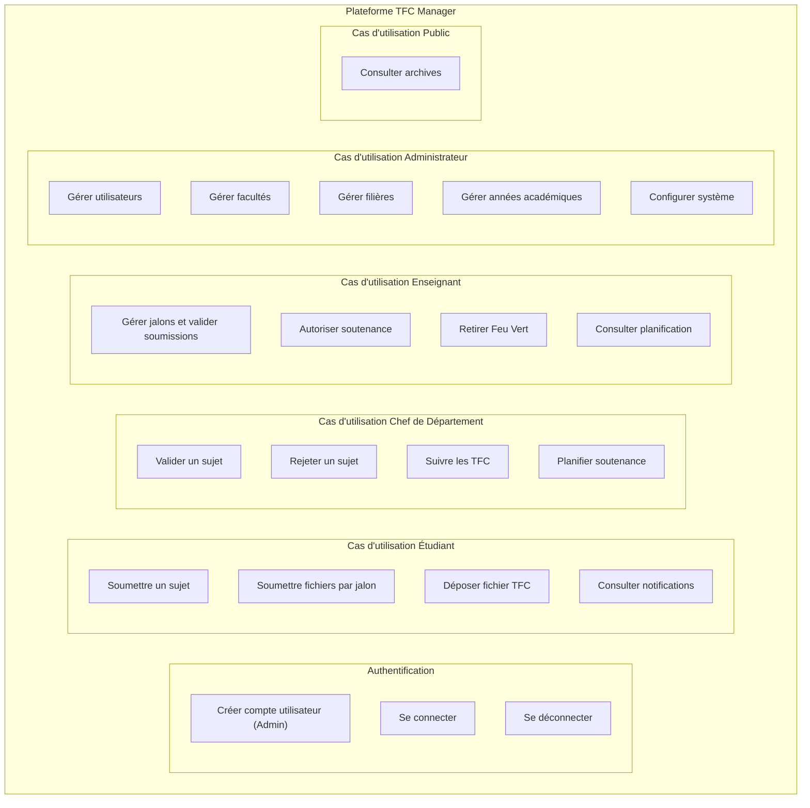

**Description:**
- Le système offre **6 modules** distincts selon le rôle
- Tous les utilisateurs authentifiés peuvent consulter le journal d'activité
- L'administrateur a accès à tous les cas d'utilisation autres
- Les visiteurs publics peuvent accéder uniquement aux archives

---

## DIAGRAMME DE CAS D'UTILISATION — ÉTUDIANT

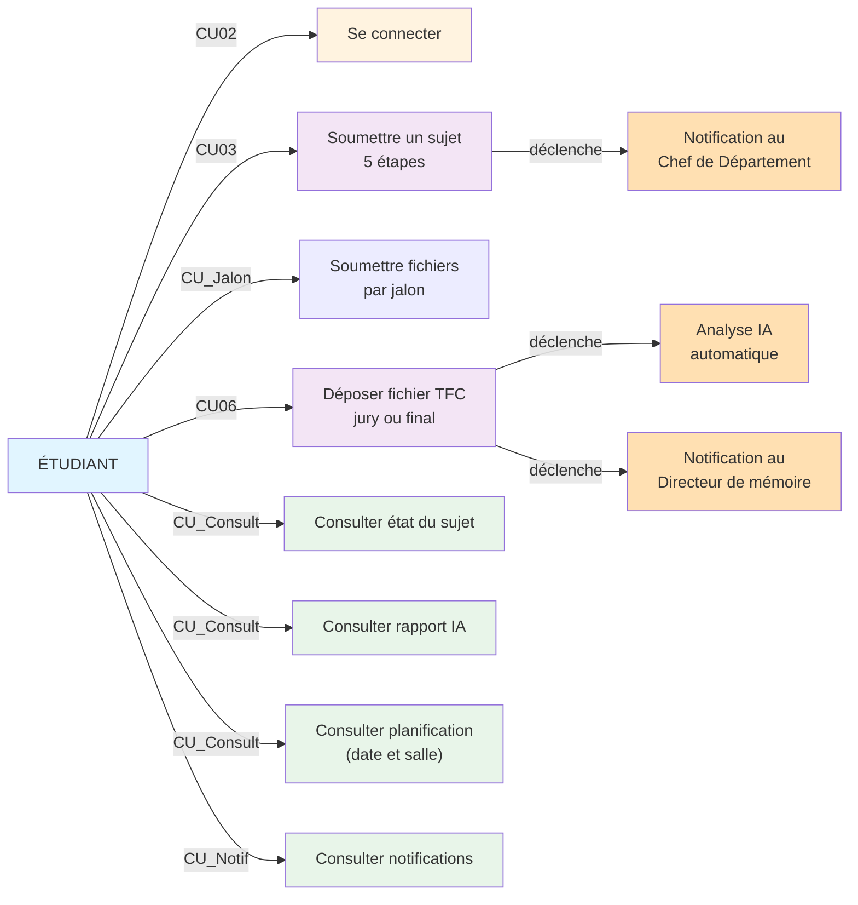

**Actions principales:**

| Action | Précondition | Résultat |
|--------|---|---|
| **Compte créé par l'admin** | Rôle et filière définis | Compte étudiant actif |
| **Se connecter** | Compte validé | Accès au tableau de bord étudiant |
| **Soumettre sujet** | Connecté, pas de sujet en attente | Sujet créé, notification au Chef de Département |
| **Soumettre fichiers par jalon** | Sujet validé, jalon en attente | Fichier soumis pour le jalon, attente de validation |
| **Déposer fichier** | Sujet validé (jury) ou autorisation de soutenance accordée (final) | Analyse IA lancée, encadreur notifié |
| **Consulter notifications** | Connecté | Affichage de tous les événements |

---

## DIAGRAMME DE CAS D'UTILISATION — CHEF DE DÉPARTEMENT

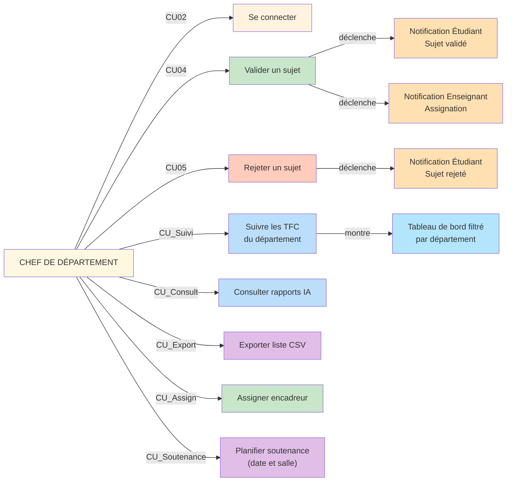

**Actions principales:**

| Action | Précondition | Résultat |
|--------|---|---|
| **Valider sujet** | Sujet en attente de sa filière | Statut validé, encadreur assigné, 2 notifications |
| **Rejeter sujet** | Sujet en attente de sa filière | Statut rejeté, motif enregistré, notification |
| **Assigner encadreur** | Validation d'un sujet | Enseignant lié au sujet |
| **Suivre TFC** | Connecté | Tableau de bord avec filtres par statut |
| **Consulter rapports IA** | Sujet avec fichier | Affichage des scores et analyses |
| **Exporter CSV** | Connecté | Téléchargement liste complète |

---

## DIAGRAMME DE CAS D'UTILISATION — ENSEIGNANT

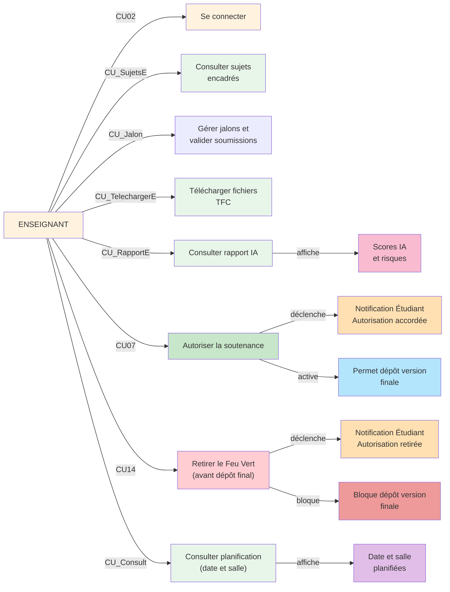

**Actions principales:**

| Action | Précondition | Résultat |
|--------|---|---|
| **Consulter sujets encadrés** | Connecté, au moins 1 sujet assigné | Liste paginée des sujets |
| **Gérer jalons** | Sujet encadré | Création de jalons, définition échéances, validation/rejet |
| **Télécharger fichiers** | Sujet avec fichier déposé | Fichier PDF en local |
| **Consulter rapport IA** | Fichier analysé | Affichage des scores et détails |
| **Autoriser soutenance** | Sujet validé, contenu satisfaisant | `defense_validated=true`, notification d'autorisation |
| **Retirer Feu Vert** | `defense_validated=true`, version finale non déposée, motif saisi | `defense_validated=false`, motif enregistré, date/salle effacées, notification de retrait |
| **Consulter planification** | Soutenance planifiée | Date et salle visibles |

---

## DIAGRAMME DE CAS D'UTILISATION — ADMINISTRATEUR

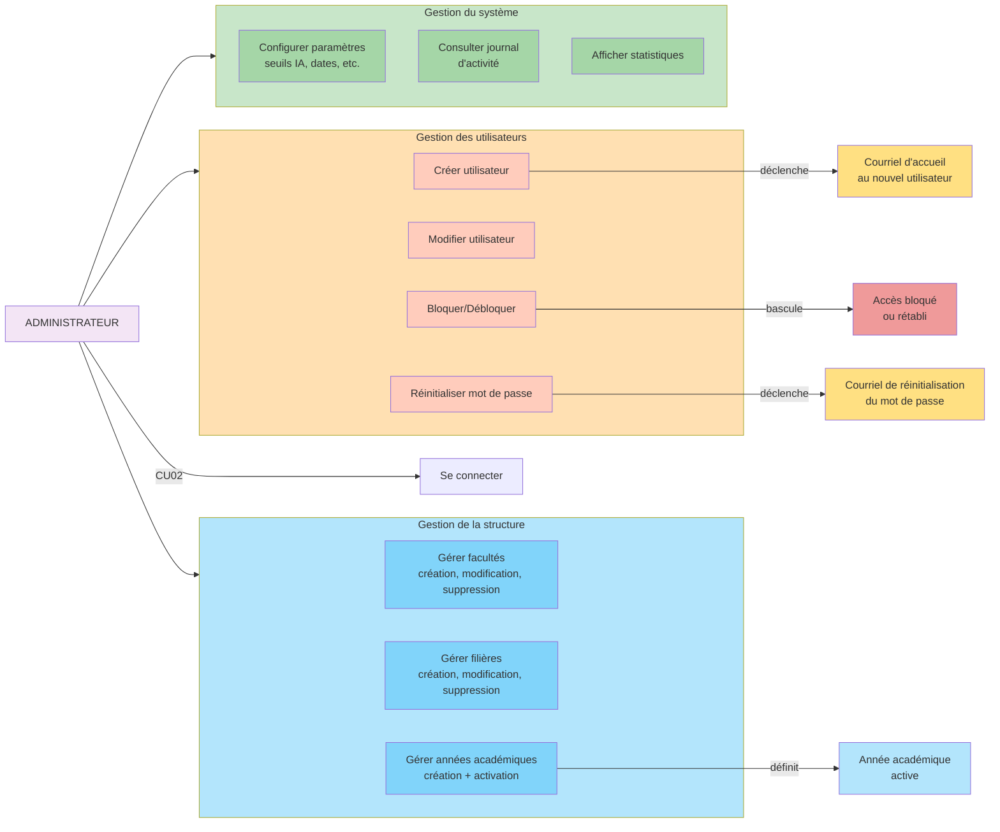

**Actions principales:**

| Action | Précondition | Résultat |
|--------|---|---|
| **Créer utilisateur** | Connecté Admin | Compte créé, courriel d'accueil envoyé |
| **Modifier utilisateur** | Utilisateur sélectionné | Données mises à jour |
| **Bloquer/Débloquer** | Utilisateur sélectionné | Accès révoqué ou rétabli |
| **Gérer facultés** | Connecté Admin | Création, modification et suppression des facultés |
| **Gérer filières** | Connecté Admin | Création, modification et suppression des filières |
| **Gérer années académiques** | Connecté Admin | Créer, activer, clôturer années |
| **Configurer paramètres** | Connecté Admin | Modifier seuils IA, dates limites, etc. |
| **Consulter journal** | Connecté Admin | Historique complet des actions |

---

## SYSTÈME EXISTANT (Processus Actuel)

### Description générale
À l'heure actuelle, l'ensemble du processus de gestion des TFC à l'Université Don Bosco de Lubumbashi repose sur des mécanismes majoritairement manuels, fragmentés et faiblement traçables. L'étudiant remplit une fiche qu'il transmet par mail, puis attend une réponse également communiquée par mail. Le directeur de mémoire est désigné par le chef de département et informé verbalement, par téléphone ou parfois par mail. La rédaction et le suivi se font principalement en présentiel. Une fois achevé, le mémoire est imprimé puis déposé à l'administration pour vérification manuelle par le comité de censure, sans contrôle automatisé de plagiat ni de contenu généré par IA. Après accord verbal ou par mail du directeur pour la soutenance, les mémoires sont finalement archivés dans des armoires physiques au secrétariat, avec un accès limité et sans mécanisme de recherche structuré.

### Étapes du processus actuel

#### 1. Dépôt de la fiche de sujet
- L'étudiant remplit une fiche de proposition de TFC
- La fiche est envoyée par mail au secrétariat de la filière
- Aucune confirmation de réception n'est automatisement générée
- Le document reste en attente sans traçabilité

#### 2. Attente de la réponse
- L'étudiant attend la décision académique
- Le traitement du dossier se fait manuellement par le secrétariat et le chef de département
- Les délais peuvent être importants (plusieurs semaines ou mois)
- Aucune notification n'informe l'étudiant de l'avancement

#### 3. Attribution du directeur
- Un enseignant est désigné comme directeur de mémoire par le chef de département
- La décision est généralement prise lors de réunions périodiques ou informellement
- Aucune documentation centralised n'existe pour justifier l'attribution

#### 4. Notification de l'enseignant
- L'enseignant désigné est informé verbalement (en personne)
- Ou par téléphone directement
- Ou par mail (selon les pratiques de chaque département)
- L'information peut être incomplète ou tardive

#### 5. Rédaction et encadrement
- L'étudiant rédige son travail sous la supervision de son directeur
- Les échanges se font essentiellement en présentiel
- Aucune plateforme de suivi n'existe
- Les versions intermédiaires ne sont pas sauvegardées

#### 6. Dépôt du document
- Le mémoire achevé est imprimé en plusieurs exemplaires
- Les exemplaires sont déposés physiquement à l'administration
- Le document est ensuite remis au comité de censure pour vérification
- **Aucune vérification automatisée de plagiat n'est effectuée**
- **Aucune vérification automatisée de contenu IA n'est effectuée**

#### 7. Autorisation de soutenance
- Le directeur donne son accord pour la soutenance de manière verbale
- Ou par mail direct
- Ou par écrit manuscrit remis à l'administration
- Pas de traçabilité de cette autorisation

#### 8. Archivage
- Les mémoires sont conservés dans des armoires physiques au secrétariat
- L'accès est limité et réservé aux responsables académiques
- Aucun système d'indexation ou de recherche n'existe
- Les travaux anciens risquent de se détériorer

### Problèmes identifiés

| Critère | Système actuel | Problème |
|---------|---|---|
| **Support** | Mail, papier et communication informelle | Risque de perte, lenteur, absence de traçabilité |
| **Validation des sujets** | Traitement manuel des fiches et réponses par mail | Délais importants et faible visibilité sur l'avancement |
| **Notification** | Mail, verbal, téléphone | L'information peut être tardive, incomplète ou non historisée |
| **Suivi** | Registres manuscrits | Aucune vue d'ensemble en temps réel |
| **Détection plagiat/IA** | Inexistante lors de la vérification par le comité de censure | Risque d'intégrité académique |
| **Archivage** | Physique (armoires) | Accès difficile, risque de détérioration |
| **Communication** | Fragmentée | Échanges non documentés |

---

## DIAGRAMME — Soumission d'un sujet (CU03)

### Contexte
Ce diagramme montre le flux complet lorsqu'un étudiant soumet un sujet de TFC via la plateforme numérique proposée.

### Acteurs impliqués
- **Étudiant** : initiateur de l'action
- **Système (SubjectController)** : traite la requête, valide les données
- **Base de données** : stocke le sujet créé
- **Chef de Département** : destinataire de la notification

### Description étape par étape

#### Étape 1 : L'étudiant remplit le formulaire
- L'étudiant accède au formulaire de soumission de sujet
- Le formulaire est structuré en 5 étapes progressives :
  1. Informations générales (titre, type)
  2. Contexte et problématique
  3. Objectifs et hypothèses
  4. Revue de littérature
  5. Méthodologie
- L'étudiant saisit toutes les informations requises
- **Travail de l'étudiant** → **Envoi au Système**

#### Étape 2 : Le système valide les données
- Le contrôleur `SubjectController` reçoit la requête
- Validation des champs obligatoires :
  - Le titre est fourni et non vide
  - Les informations de contexte sont présentes
  - Les objectifs sont clairement définis
  - Les méthodologies sont décrites
- **Travail du Système** : validation côté serveur
- **Communication** : Système ↔ Base de données

#### Étape 3 : Vérification des préconditions
- Le système vérifie que cet étudiant n'a pas déjà un sujet en attente (`pending`)
- Le système vérifie que cet étudiant n'a pas déjà un sujet validé
- Cette vérification prévient les doublons et les soumissions multiples abusives
- **Travail du Système** : interrogation de la base de données
- **Résultat** : OK (conditions remplies) ou erreur (sujet existant)

#### Étape 4 : Création du sujet dans la base de données
- Un nouvel enregistrement `Subject` est créé
- État initial du sujet : `status = 'pending'` (en attente)
- Attributs enregistrés :
  - Titre, description, type (TFC ou Mémoire)
  - Contexte, problématique, recherche
  - Hypothèses, objectifs généraux et spécifiques
  - Revue de littérature, délimitations, méthodologies
  - `student_id` : ID de l'étudiant
  - `teacher_id` : NULL (pas encore assigné)
  - `academic_year_id` : année académique courante
- **Travail du Système** : insertion dans la base de données
- **Résultat** : ID du sujet généré (ex: sujet #42)

#### Étape 5 : Envoi de la notification au Chef de Département
- Une notification de type `NewSubjectSubmitted` est créée
- La notification est envoyée au Chef de Département de la filière de l'étudiant
- **Canaux de notification** :
  - **E-mail** : le CP reçoit un mail avec le titre et le résumé du sujet
    - **Dans l'application** : une notification s'affiche dans le tableau de bord du CP
  - **Contenu** : lien pour consulter le sujet complet et décider (valider/rejeter)
- **Travail du Système** : création et envoi de notification
- **Destination** : Chef de Département

#### Étape 6 : Redirection et confirmation à l'étudiant
- L'étudiant est redirigé vers son tableau de bord
- Un message de succès s'affiche : « Votre sujet a été soumis avec succès »
- L'étudiant voit son sujet avec le statut `Pending` (en attente)
- **Travail du Système** : HTTP 302 Redirect
- **Interface utilisateur** : affichage du message et de l'état du sujet

### Fluxogramme ASCII
```
Étudiant          Système (SubjectController)     Base de données     Chef Département
    │                        │                           │                    │
    │  1. Remplir formulaire │                           │                    │
    │  (5 étapes)            │                           │                    │
    │───────────────────────>│                           │                    │
    │                        │                           │                    │
    │                        │  2. Valider les données   │                    │
    │                        │───────────────────────────>│                    │
    │                        │                           │                    │
    │                        │  3. Vérifier: pas de sujet│                    │
    │                        │  pending ou validé        │                    │
    │                        │───────────────────────────>│                    │
    │                        │                           │                    │
    │                        │  4. OK                    │                    │
    │                        │<──────────────────────────│                    │
    │                        │                           │                    │
    │                        │  5. Créer Subject         │                    │
    │                        │  (status='pending')       │                    │
    │                        │───────────────────────────>│                    │
    │                        │  6. Subject créé (id)     │                    │
    │                        │<──────────────────────────│                    │
    │                        │                           │                    │
    │                        │  7. Envoyer notification  │                    │
    │                        │  (NewSubjectSubmitted)    │                    │
    │                        │──────────────────────────────────────────────>│
    │                        │                           │                    │
    │  8. Redirect + success │                           │                    │
    │<───────────────────────│                           │                    │
```

---

## DIAGRAMME — Validation d'un sujet (CU04)

### Contexte
Ce diagramme montre le flux lorsqu'un Chef de Département examine et valide un sujet soumis par un étudiant.

### Acteurs impliqués
- **Chef de Département** : initiateur (valide le sujet et assigne un encadreur)
- **Système (SubjectController)** : traite la validation
- **Base de données** : met à jour l'état du sujet
- **Étudiant** : destinataire de la notification de validation
- **Enseignant** : destinataire de la notification d'assignation

### Description étape par étape

#### Étape 1 : Le Chef de Département sélectionne un sujet
- Le CP accède à son tableau de bord - section « Sujets en attente »
- Le CP affiche la liste des sujets `pending` de sa filière
- Le CP clique sur un sujet pour le consulter
- Le CP lit le titre, la description, la problématique et les objectifs
- **Interface** : formulaire de validation avec :
  - Afficage du sujet complet
  - Boutons d'action « Valider » et « Rejeter »
  - Menu déroulant pour sélectionner un enseignant encadreur

#### Étape 2 : Sélection de l'enseignant encadreur
- Le CP choisit un enseignant parmi ceux de sa filière
- Le système affiche la liste des enseignants disponibles
- Le CP peut filtrer par domaine de compétence (si disponible)
- Le CP clique sur un enseignant et appuie sur « Valider »
- **Travail du CP** : consultation et décision

#### Étape 3 : Vérification des droits
- Le système vérifie que le sujet appartient à la même filière que le CP
- Le système vérifie que l'enseignant sélectionné appartient à la même filière
- Le système vérifie que le sujet a bien le statut `pending`
- Résultat : **OK** ou **erreur** (unauthorized)
- **Travail du Système** : validation des permissions et du statut

#### Étape 4 : Mise à jour du sujet dans la BD
- Le sujet est mis à jour avec les nouvelles valeurs :
  - `status = 'validated'` (changement d'état)
  - `teacher_id = [ID de l'enseignant assigné]` (affectation du directeur)
  - `updated_at = NOW()` (horodatage de la modification)
- **Travail du Système** : UPDATE dans la base de données
- **Résultat** : sujet maintenant validé et assigné

#### Étape 5 : Notification de l'étudiant
- Une notification de type `SubjectValidated` est créée
- La notification contient :
  - Message : « Votre sujet a été accepté »
  - Nom de l'enseignant assigné
  - Lien pour consulter les détails
- **Canaux** : Courriel + notification dans l'application
- **Destinataire** : Étudiant
- L'étudiant reçoit la notification et voit son sujet passer au statut `Validé`

#### Étape 6 : Notification de l'enseignant
- Une notification de type `TeacherAssigned` est créée
- La notification contient :
  - Message : « Vous avez été assigné comme directeur pour le sujet : [titre] »
  - Nom de l'étudiant
  - Résumé du sujet
  - Lien vers le tableau de bord pour consulter les détails de l'étudiant
- **Canaux** : Courriel + notification dans l'application
- **Destinataire** : Enseignant assigné
- L'enseignant reçoit la notification et voit le sujet assigné apparaître dans sa liste

#### Étape 7 : Redirection et confirmation au CP
- Le CP est redirigé vers la liste actualisée des sujets
- Un message de succès s'affiche : « Le sujet a été validé et l'enseignant a été notifié »
- Le sujet disparaît de la liste « En attente » et apparaît dans « Validés »
- **Interface** : actualisation et affichage du statut

### Fluxogramme ASCII
```
Chef Département    Système (SubjectController)    Base de données    Étudiant    Enseignant
    │                        │                           │               │            │
    │  1. Sélectionner sujet │                           │               │            │
    │  + enseignant          │                           │               │            │
    │───────────────────────>│                           │               │            │
    │                        │                           │               │            │
    │                        │  2. Vérifier: même dept   │               │            │
    │                        │───────────────────────────>│               │            │
    │                        │  3. OK                    │               │            │
    │                        │<──────────────────────────│               │            │
    │                        │                           │               │            │
    │                        │  4. Update Subject:       │               │            │
    │                        │  status='validated'       │               │            │
    │                        │  teacher_id=enseignant    │               │            │
    │                        │───────────────────────────>│               │            │
    │                        │                           │               │            │
    │                        │  5. Notifier étudiant     │               │            │
    │                        │  (SubjectValidated)       │               │            │
    │                        │──────────────────────────────────────────>│            │
    │                        │                           │               │            │
    │                        │  6. Notifier enseignant   │               │            │
    │                        │  (TeacherAssigned)        │               │            │
    │                        │─────────────────────────────────────────────────────>│
    │                        │                           │               │            │
    │  7. Redirect + success │                           │               │            │
    │<───────────────────────│                           │               │            │
```

---

## DIAGRAMME — Dépôt de fichier avec analyse IA (CU06)

### Contexte
Ce diagramme illustre le processus complet lorsqu'un étudiant dépose un fichier PDF (version jury ou finale) et que le système effectue automatiquement une analyse IA.

### Acteurs impliqués
- **Étudiant** : dépositaire du fichier
- **Système (ThesisFileController)** : gère le dépôt et orchestration
- **Stockage** : écriture physique du fichier PDF
- **AiDetectionService** : service métier d'analyse IA
- **API GPTZero** : service externe de détection IA
- **Base de données** : enregistrement des métadonnées et rapports

### Description étape par étape

#### Étape 1 : L'étudiant prépare le dépôt
- L'étudiant se connecte à son tableau de bord
- L'étudiant vérifie l'état de son sujet (doit être `validé`)
- L'étudiant sélectionne le type de version :
    - **Version jury** : première version à analyser (autorisée après validation du sujet)
  - **Version finale** : dernière version après accord du directeur (autorisée après « Feu Vert »)
- **Travail de l'étudiant** : sélection du fichier PDF depuis son ordinateur

#### Étape 2 : Upload du fichier
- L'étudiant clique sur le bouton « Déposer un fichier »
- Un sélecteur de fichier s'ouvre
- L'étudiant choisit un fichier PDF
- Le formulaire est soumis via HTTP POST
- **Communication** : Étudiant → Système (HTTP file upload)

#### Étape 3 : Validation du fichier (côté serveur)
- Le système valide immédiatement le fichier uploadé :
  - **Format** : doit être un fichier PDF (vérification de l'extension et de la signature du fichier)
  - **Taille** : maximum 20 Mo (validation de la taille)
  - **Préexistence** : on vérifie qu'aucun fichier du même type (`version_type`) n'existe déjà pour ce sujet
- **Résultat** : validation réussie ou bloc avec message d'erreur
- **Travail du Système** : validation des formats et contraintes

#### Étape 4 : Stockage physique du fichier
- Si la validation réussit, le fichier est copié vers le dossier de stockage sécurisé
- Chemin de stockage : `storage/app/public/tfc_files/{year}/{subject_id}/{filename_unique}.pdf`
- Le nom original du fichier est préservé (pour l'affichage à l'utilisateur)
- **Travail du Système** : écriture sur disque
- **Communication** : Système → Stockage

#### Étape 5 : Enregistrement dans la base de données
- Un nouvel enregistrement `ThesisFile` est créé avec :
  - `subject_id` : ID du sujet
  - `file_path` : chemin de stockage unique
  - `original_name` : nom original du fichier fourni par l'étudiant
  - `version_type` : `'jury'` ou `'final'`
  - `created_at` : timestamp du dépôt
- **Travail du Système** : INSERT dans la BD
- **Résultat** : ID du fichier généré (ex: thesis_file#156)

#### Étape 6 : Lancement de l'analyse IA (asynchrone)
- Le système crée une tâche `AiDetectionService::analyze($thesisFile)`
- Cette tâche est exécutée :
  - **En synchrone** pendant le développement/test
  - **En asynchrone** via une file d'attente (queue) en production
- L'étudiant ne "bloque" pas en attendant que l'analyse se termine
- **Travail du Système** : appel au service d'analyse IA

#### Étape 7 : Extraction du texte du PDF
- Le service `AiDetectionService` utilise la bibliothèque `smalot/pdfparser`
- Le texte brut est extrait de toutes les pages du PDF
- Le texte est nettoyé (suppression des caractères de contrôle, normalisation des espaces)
- Si le PDF dépasse 50 000 caractères, seule la première partie est conservée (limitation de l'API)
- **Travail du Service** : analyse du fichier PDF
- **Communication** : AiDetectionService ← Stockage (lecture du fichier)

#### Étape 8 : Appel à l'API GPTZero
- Si une clé API GPTZero est configurée :
  - Le texte extrait est envoyé à l'API GPTZero via une requête HTTP POST
  - Endpoint : `https://api.gptzero.me/v2/predict`
  - Headers : `Authorization: Bearer [API_KEY]`, `Content-Type: application/json`
  - Body : `{ "document": "[texte extrait]" }`
- **Résultat** : API retourne les probabilités :
  - `completely_generated_prob` : probabilité que le texte soit 100% généré par IA (ex: 0.15)
  - `average_generated_prob` : probabilité moyenne de contenu généré (ex: 0.32)
  - `sentences` : liste détaillée des phrases signalées avec leurs scores
- **Communication** : AiDetectionService → API GPTZero (HTTP)

#### Étape 9 : Calcul des scores
- Les probabilités retournées par GPTZero sont converties en scores 0-100 :
  - `ai_score = ROUND(average_generated_prob * 100)` (ex: 0.32 × 100 = 32)
  - `similarity_score = ROUND((1 - completely_generated_prob) * 100)` (ex: (1 - 0.15) × 100 = 85)
- **Interprétation** :
    - **ai_score > 50** : risque élevé de contenu généré (rouge)
    - **ai_score 20-50** : risque modéré (jaune)
    - **ai_score < 20** : risque faible, contenu considéré comme original (vert)
- **Travail du Service** : calcul et normalisation

#### Étape 10 : Enregistrement du rapport d'analyse
- Un nouvel enregistrement `AiReport` est créé avec :
  - `thesis_file_id` : ID du fichier analysé
  - `similarity_score` : score calculé
  - `ai_score` : score de contenu IA
  - `details` : JSON contenant les détails complets de l'API (phrases signalées, etc.)
  - `created_at` : timestamp de l'analyse
- **Travail du Service** : INSERT dans la BD
- **Communication** : Système ← Base de données (confirmation)

#### Étape 11 : Notification du directeur de mémoire
- Une notification de type `ThesisFileUploaded` est créée
- **Destinataire** : Enseignant (directeur de mémoire assigné)
- **Contenu** :
  - Message : « Un fichier a été déposé pour le sujet : [titre] »
  - Nom de l'étudiant
  - Lien pour consulter le fichier et le rapport IA
  - Résumé du rapport IA (score et niveau de risque)
- **Canaux** : Courriel + notification dans l'application
- **Travail du Système** : création et envoi de notification

#### Étape 12 : Redirection et confirmation à l'étudiant
- L'étudiant est redirigé vers son tableau de bord
- Un message de succès s'affiche : « Votre fichier a été déposé avec succès »
- Le rapport d'analyse IA s'affiche automatiquement :
  - Score avec barre de progression colorée
  - Interprétation du risque
  - Lien vers le rapport détaillé
- **Interface** : affichage du rapport et du statut du fichier

### Fluxogramme ASCII
```
Étudiant     Système (ThesisFileController)    Stockage    AiDetectionService    GPTZero API    BDD
    │                   │                          │               │                   │          │
    │  1. Upload PDF    │                          │               │                   │          │
    │  + version_type   │                          │               │                   │          │
    │──────────────────>│                          │               │                   │          │
    │                   │                          │               │                   │          │
    │                   │  2. Valider (PDF,≤20Mo)  │               │                   │          │
    │                   │─────────────────────────>│               │                   │          │
    │                   │  3. Stocker fichier      │               │                   │          │
    │                   │  tfc_files/xxx.pdf       │               │                   │          │
    │                   │─────────────────────────>│               │                   │          │
    │                   │                          │               │                   │          │
    │                   │  4. Créer ThesisFile     │               │                   │          │
    │                   │──────────────────────────────────────────────────────────────────────>│
    │                   │                          │               │                   │          │
    │                   │  5. analyze(thesisFile)  │               │                   │          │
    │                   │─────────────────────────────────────────>│                   │          │
    │                   │                          │               │                   │          │
    │                   │              6. Extraire texte PDF       │                   │          │
    │                   │              (smalot/pdfparser)          │                   │          │
    │                   │                          │<──────────────│                   │          │
    │                   │                          │               │                   │          │
    │                   │                          │               │  7. POST /predict  │          │
    │                   │                          │               │  (texte extrait)   │          │
    │                   │                          │               │──────────────────>│          │
    │                   │                          │               │  8. Scores IA     │          │
    │                   │                          │               │<─────────────────│          │
    │                   │                          │               │                   │          │
    │                   │                          │               │  9. Créer AiReport│          │
    │                   │                          │               │──────────────────────────>│
    │                   │                          │               │                   │          │
    │                   │  10. Notifier encadreur  │               │                   │          │
    │                   │  (ThesisFileUploaded)    │               │                   │          │
    │                   │                          │               │                   │          │
    │  11. Redirect     │                          │               │                   │          │
    │  + success        │                          │               │                   │          │
    │<─────────────────│                          │               │                   │          │
```

---

## DIAGRAMME — Autorisation et planification de soutenance (CU07 + CU13)

### Contexte
Ce diagramme montre le processus par lequel un directeur de mémoire examine le travail et autorise (ou non) la soutenance.

### Acteurs impliqués
- **Enseignant** : directeur de mémoire, qui donne l'autorisation
- **Système (SubjectController)** : traite l'autorisation
- **Base de données** : met à jour l'état du sujet
- **Étudiant** : destinataire du « Feu Vert »

### Description étape par étape

#### Étape 1 : L'enseignant consulte le tableau de bord
- L'enseignant se connecte à son tableau de bord
- L'enseignant voit la section « Mes sujets encadrés »
- Pour chaque sujet, l'enseignant voit :
  - Nom de l'étudiant(e)
  - Titre du sujet
  - État du sujet (`validé`)
  - État du fichier déposé (jury ou finale)
  - Rapport d'analyse IA (scores et résumé)
  - Bouton « Autoriser la soutenance » (si conditions remplies)
- **Travail de l'enseignant** : consultation et lecture

#### Étape 2 : L'enseignant examine le fichier et le rapport IA
- L'enseignant clique sur le lien « Consulter le fichier »
- Le PDF s'ouvre (dans un lecteur intégré ou par téléchargement)
- L'enseignant consulte le rapport d'analyse IA :
  - Score de contenu IA et interprétation
  - Détails des sections signalées
  - Probabilités calculées
- L'enseignant peut décider de :
    - Autoriser directement la soutenance
- **Travail de l'enseignant** : analyse et décision

#### Étape 3 : L'enseignant clique sur « Autoriser la soutenance »
- L'enseignant appuie sur le bouton « Feu Vert — Autoriser la soutenance »
- **Interface** : confirmation simple

#### Étape 4 : Vérification des permissions
- Le système vérifie que l'utilisateur authentifié est bien l'enseignant encadreur du sujet
- Le système vérifie que le statut du sujet est `validated` (pas `pending` ou `rejected`)
- Le système vérifie que le sujet n'a pas déjà un `defense_validated = true`
- **Résultat** : autorisation accordée ou rejet avec message d'erreur
- **Travail du Système** : validation des droits et du statut

#### Étape 5 : Mise à jour du sujet
- Le sujet est mis à jour dans la base de données :
  - `defense_validated = true` (indicateur d'autorisation)
  - `updated_at = NOW()` (horodatage)
- **Travail du Système** : UPDATE dans la BD
- **Résultat** : statut du sujet changé, soutenance autorisée

#### Étape 6 : Notification de l'étudiant
- Une notification de type `DefenseAuthorized` est créée
- **Destinataire** : Étudiant
- **Contenu** :
    - Message : « Félicitations ! Votre directeur de mémoire vous autorise à soutenir »
    - Indicateur visuel d'autorisation
  - Lien pour consulter les prochaines étapes
  - Instructions pour préparer la soutenance
- **Canaux** : Courriel principal + notification dans l'application
- L'étudiant voit immédiatement l'état du sujet passer à « Feu Vert - Soutenance autorisée »

#### Étape 7 : Redirection et confirmation
- L'enseignant est redirigé vers son tableau de bord
- Un message de succès s'affiche : « La soutenance a été autorisée »
- Le sujet disparaît de la liste « En cours » et apparaît dans « En soutenance »
- **Interface** : actualisation de la page avec le nouveau statut

#### Étape 8 : Planification par le Chef de Département
- Le Chef de Département renseigne la **date** et la **salle**
- Le système enregistre `defense_date` et `defense_room`
- Les informations deviennent visibles sur les tableaux de bord concernés

### Fluxogramme ASCII
```
Enseignant       Système (SubjectController)      Base de données      Étudiant
    │                       │                            │                  │
    │  1. Consulter         │                            │                  │
    │  file + rapport IA    │                            │                  │
    │───────────────────────>                            │                  │
    │                       │  2. Afficher fichier       │                  │
    │                       │     et rapport             │                  │
    │                       │<───────────────────────────│                  │
    │                       │                            │                  │
    │  3. Cliquer sur       │                            │                  │
    │  « Autoriser »        │                            │                  │
    │───────────────────────>                            │                  │
    │                       │                            │                  │
    │                       │  4. Vérifier permissions   │                  │
    │                       │     et statut du sujet     │                  │
    │                       │───────────────────────────>│                  │
    │                       │  5. OK                     │                  │
    │                       │<──────────────────────────│                  │
    │                       │                            │                  │
    │                       │  6. Update:                │                  │
    │                       │  defense_validated=true    │                  │
    │                       │───────────────────────────>│                  │
    │                       │                            │                  │
    │                       │  7. Notification « FeuVert »                  │
    │                       │─────────────────────────────────────────────>│
    │                       │                            │                  │
    │  8. Redirect +        │                            │                  │
    │  success              │                            │                  │
    │<──────────────────────│                            │                  │
    │                       │                            │                  │
    │  9. Planifier          │                            │                  │
    │  date + salle          │                            │                  │
    │───────────────────────>                            │                  │
    │                       │  10. Enregistrer            │                  │
    │                       │  defense_date/room          │                  │
    │                       │───────────────────────────>│                  │
```

---

---

## DIAGRAMME DE SÉQUENCE — SOUMISSION DE SUJET

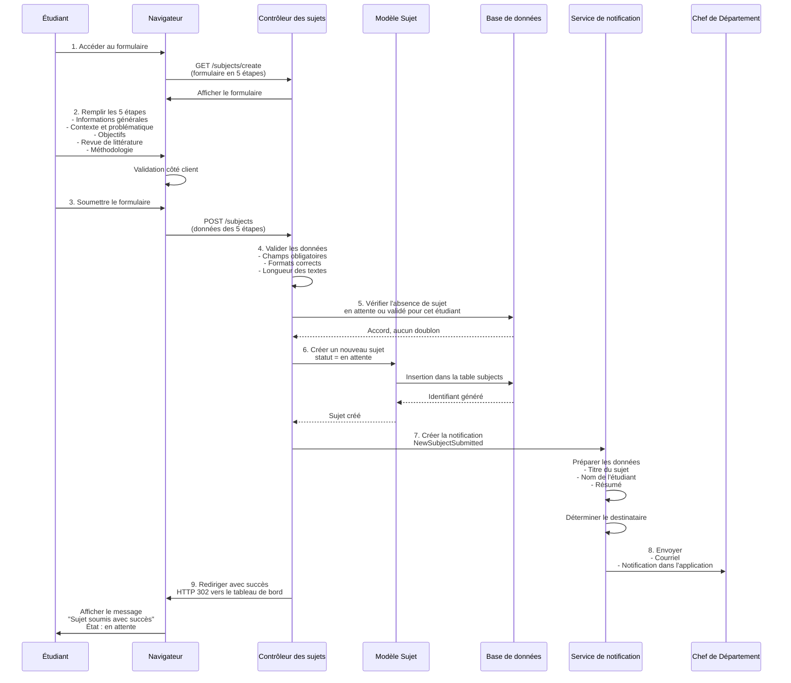

**Flux détaillé:**

1. **Accès au formulaire** : L'étudiant clique sur « Nouveau Sujet »
2. **Remplissage** : Formulaire structure en 5 étapes progressives
3. **Soumission** : POST JSON avec tous les champs
4. **Validation** : Vérification côté serveur des données
5. **Unicité** : Confirmation qu'aucun sujet en attente ou validé n'existe
6. **Création** : INSERT dans la table `subjects` avec `status = 'pending'`
7. **Notification** : Création d'une notification `NewSubjectSubmitted`
8. **Envoi** : Courriel + notification dans l'application au Chef de Département
9. **Confirmation** : Redirection vers le tableau de bord avec message de succès

---

## DIAGRAMME DE SÉQUENCE — VALIDATION/REJET DE SUJET

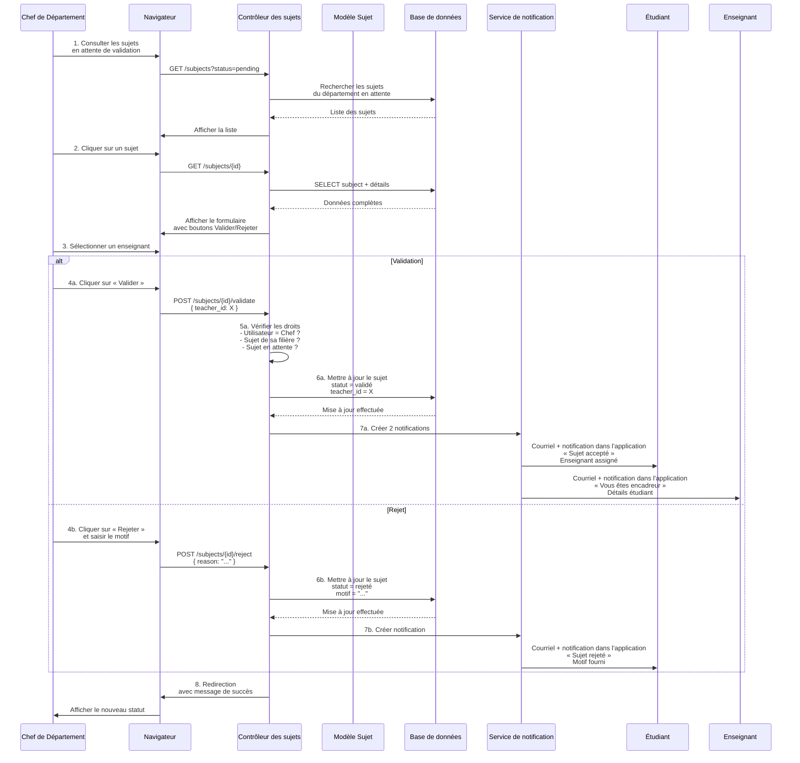

**Flux Validation:**

1. **Consultation** : Le Chef affiche la liste des sujets en attente
2. **Sélection** : Chef clique sur un sujet pour détails
3. **Lecture** : Affichage complet du sujet + formulaire de validation
4. **Sélection enseignant** : Liste déroulante avec les enseignants de la filière
5. **Vérification droits** : Confirmation que le Chef agit dans sa filière et sur un sujet en attente
6. **Mise à jour** : Changement du statut en validé avec affectation de l'enseignant
7. **Notifications** : Courriel + notification dans l'application à l'étudiant et à l'enseignant
8. **Confirmation** : Redirection avec message succès

**Flux Rejet:**
- Étapes 1-3 : identiques
- Étape 4b : Chef saisit motif du rejet
- Étape 6b : Changement du statut en rejeté avec enregistrement du motif
- Étape 7b : Notification à l'étudiant avec motif
- Étudiant peut resoumettre un nouveau sujet

---

## DIAGRAMME DE SÉQUENCE — DÉPÔT DE FICHIER AVEC ANALYSE IA

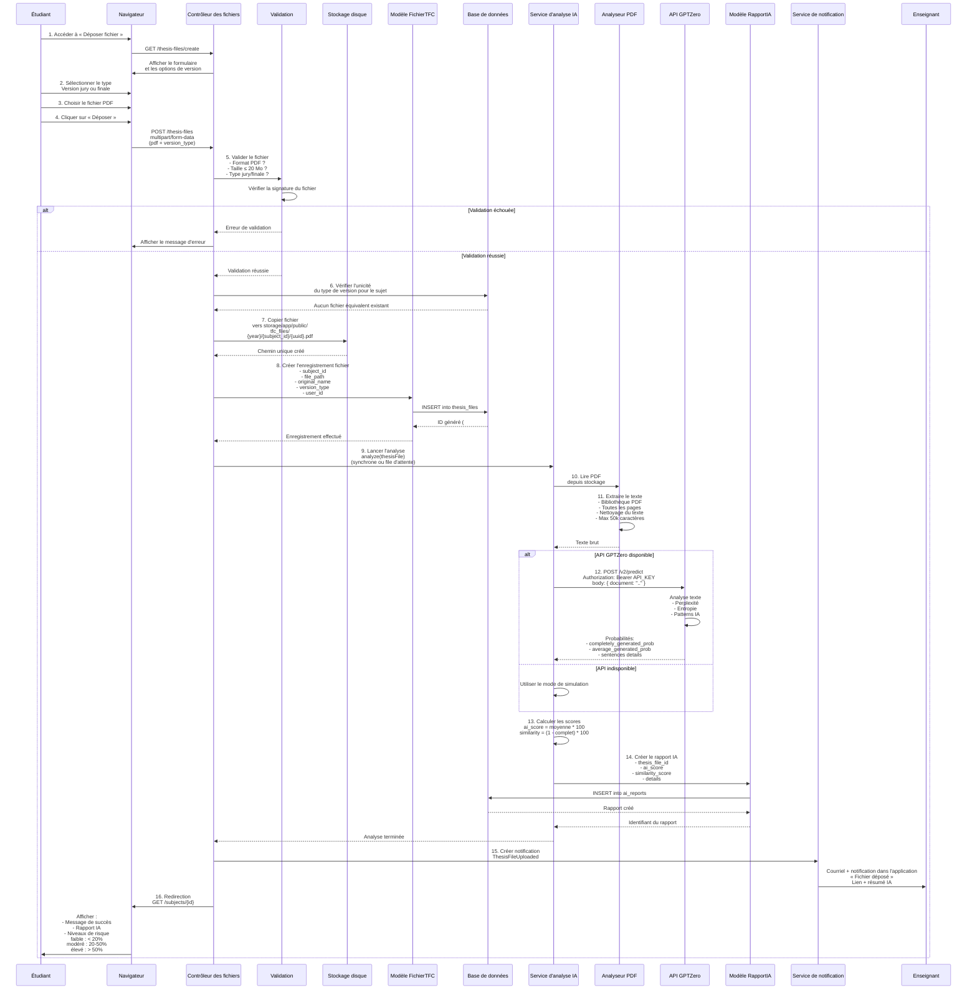

**Flux détaillé:**

1. **Accès** : Étudiant clique sur « Déposer un fichier »
2. **Sélection type** : Jury (avant feu vert) ou Final (après feu vert)
3. **Sélection fichier** : Boîte de sélection du fichier PDF
4. **Envoi** : Requête multipart/form-data avec le fichier
5. **Validation** : Format, taille, existence d'un fichier du même type
6. **Vérification unicité** : Un seul fichier par type (jury OU final)
7. **Stockage physique** : Copie vers le dossier securisé avec UUID
8. **Création BD** : Enregistrement ThesisFile avec métadonnées
9. **Lancement analyse** : Tâche lancée en synchrone ou via file d'attente
10. **Extraction texte** : PDF Parser lit le fichier original
11. **Nettoyage** : Normalisation du texte, limitation 50k chars
12. **Appel API** : GPTZero analyse le texte
13. **Calcul scores** : Conversion probabilités en scores 0-100
14. **Création rapport** : Enregistrement AiReport avec détails
15. **Notification** : Courriel + notification dans l'application au directeur
16. **Confirmation** : Redirection vers sujet avec rapport IA affiché

**Interprétation des scores IA:**
- **< 20%** : Faible risque, contenu original
- **20-50%** : Risque modéré, vérification recommandée
- **> 50%** : Risque élevé, entretien avec l'étudiant obligatoire

---

## DIAGRAMME DE SÉQUENCE — AUTORISATION ET PLANIFICATION DE SOUTENANCE

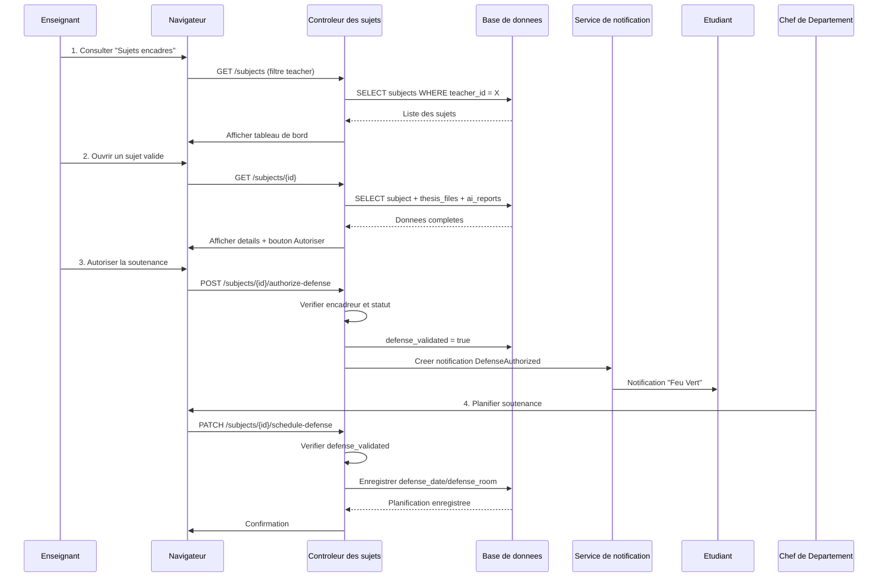

**Flux Autorisation:**

1. **Consultation sujets** : Enseignant affiche sa liste de sujets encadrés
2. **Sélection sujet** : Clique sur un sujet en état validé
3. **Consultation fichiers** : Téléchargement ou visionnage en intégré
4. **Consultation rapport IA** : Affichage des scores et risques détectés
5. **Évaluation** : Enseignant juge la qualité et l'originalité
6. **Accord d'autorisation** : Clique sur « Autoriser la soutenance »
7. **Confirmation** : POST vers l'API
8. **Vérification droits** : Confirmation que l'enseignant est bien l'encadreur
9. **Mise à jour BD** : `defense_validated=TRUE`
10. **Notification** : Courriel + notification dans l'application à l'étudiant
11. **Confirmation** : Affichage du nouveau statut

**Flux complémentaire:**
- Le Chef de Département planifie la soutenance apres le Feu Vert

---

## DIAGRAMME DE CLASSES

```mermaid
classDiagram
    class User {
        int id
        string name
        string email
        string password
        string matricule
        int department_id
        boolean is_blocked
        timestamp created_at
        timestamp updated_at
        +department() BelongsTo
        +subjectsAsStudent() HasMany
        +subjectsAsTeacher() HasMany
        +notifications() HasMany
    }
    
    class Faculty {
        int id
        string name
        string code
        text description
        timestamp created_at
        timestamp updated_at
        +departments() HasMany
    }
    
    class Department {
        int id
        int faculty_id
        string name
        string code
        text description
        timestamp created_at
        timestamp updated_at
        +faculty() BelongsTo
        +users() HasMany
        +subjects() HasMany
    }
    
    class AcademicYear {
        int id
        string name
        date start_date
        date end_date
        boolean is_current
        boolean is_closed
        timestamp created_at
        timestamp updated_at
        +subjects() HasMany
        +static current() AcademicYear
        +setAsCurrent() void
        +close() void
    }
    
    class Subject {
        int id
        int student_id
        int teacher_id
        int department_id
        int academic_year_id
        string title
        enum subject_type
        text description
        text context_relevance
        text challenges
        text research_question
        text hypothesis
        text general_objective
        json specific_objectives
        json state_of_art
        text demarcations
        text methodologies
        enum status
        text rejection_reason
        boolean defense_validated
        datetime defense_date
        string defense_room
        timestamp created_at
        timestamp updated_at
        +student() BelongsTo~User
        +teacher() BelongsTo~User
        +department() BelongsTo
        +academicYear() BelongsTo
        +thesisFiles() HasMany
        +isValidated() boolean
        +isPending() boolean
    }
    
    class ThesisFile {
        int id
        int subject_id
        string file_path
        string original_name
        enum version_type
        timestamp created_at
        timestamp updated_at
        +subject() BelongsTo
        +aiReport() HasOne
    }
    
    class AiReport {
        int id
        int thesis_file_id
        double similarity_score
        double ai_score
        json details
        timestamp created_at
        timestamp updated_at
        +thesisFile() BelongsTo
    }
    
    class Notification {
        int id
        string type
        timestamp read_at
        json data
        timestamp created_at
        +markAsRead() void
    }
    
    class ActivityLog {
        int id
        int user_id
        string action
        string model_type
        int model_id
        string description
        json old_values
        json new_values
        timestamp created_at
        +user() BelongsTo
        +static log() void
    }
    
    class SystemSetting {
        int id
        string key
        text value
        string type
        string group
        string label
        text description
        +static get() mixed
        +static set() void
        +static getGroup() Collection
    }
    
    %% Relations
    User "1" --> "0..*" Subject : encadre
    User "1" --> "0..*" Subject : soumet
    Faculty "1" --> "1..*" Department : contient
    Department "1" --> "0..*" User : rattache
    Department "1" --> "0..*" Subject : filière
    AcademicYear "1" --> "0..*" Subject : regroupe
    Subject "1" --> "0..2" ThesisFile : contient
    ThesisFile "1" --> "0..1" AiReport : analyse
    User "1" --> "0..*" Notification : reçoit
    User "1" --> "0..*" ActivityLog : génère
```

**Architecture des classes:**

| Classe | Rôle | Clés étrangères |
|--------|------|---|
| **User** | Utilisateur (étudiant, enseignant, CP, admin) | department_id |
| **Faculty** | Faculté (ESIS, ECOPO, etc.) | — |
| **Department** | Filière (GL, AS, etc.) | faculty_id |
| **AcademicYear** | Année académique | — |
| **Subject** | Sujet de TFC | student_id, teacher_id, department_id, academic_year_id |
| **ThesisFile** | Fichier PDF déposé | subject_id |
| **AiReport** | Rapport d'analyse IA | thesis_file_id |
| **Notification** | Notification utilisateur | user_id |
| **ActivityLog** | Journal d'audit | user_id |
| **SystemSetting** | Paramètres système | — |

**Relations principales:**

- `User` encadre (`teacher_id`) ou soumet (`student_id`) des `Subject`
- `Subject` appartient à un `Department` et une `AcademicYear`
- `Subject` peut avoir 0, 1 ou 2 `ThesisFile` (jury + final)
- `ThesisFile` génère un `AiReport` après analyse

---

## MODÈLE RELATIONNEL DE LA BASE DE DONNÉES

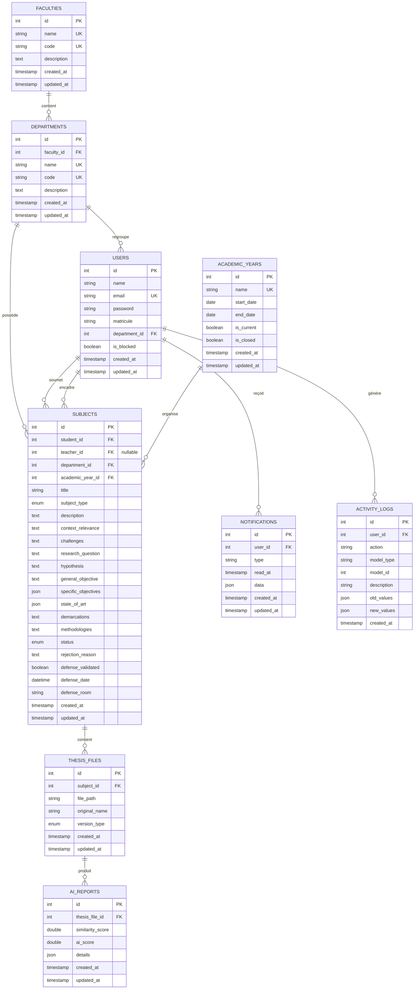

**Description des tables:**

| Table | Rôle | Clés étrangères |
|-------|------|---|
| **FACULTIES** | Regroupement des filières (ESIS, ECOPO, etc.) | — |
| **DEPARTMENTS** | Filières spécifiques (GL, AS, etc.) | faculty_id |
| **USERS** | Tous les utilisateurs (étudiants, enseignants, CP, admin) | department_id |
| **ACADEMIC_YEARS** | Années académiques (2025-2026, etc.) | — |
| **SUBJECTS** | Sujets de TFC soumis | student_id, teacher_id*, department_id, academic_year_id |
| **THESIS_FILES** | Fichiers PDF déposés (jury + final) | subject_id |
| **AI_REPORTS** | Rapports d'analyse IA pour chaque fichier | thesis_file_id |
| **NOTIFICATIONS** | Notifications utilisateurs (email + in-app) | user_id |
| **ACTIVITY_LOGS** | Journal d'audit de toutes les actions | user_id |

**Cardinalités:**

- **FACULTIES → DEPARTMENTS** : 1 → *  (une faculté = plusieurs filières)
- **DEPARTMENTS → USERS** : 1 → * (une filière = plusieurs utilisateurs)
- **DEPARTMENTS → SUBJECTS** : 1 → * (une filière = plusieurs sujets)
- **USERS → SUBJECTS (student)** : 1 → * (un étudiant = plusieurs sujets possibles / historique)
- **USERS → SUBJECTS (teacher)** : 1 → * (un enseignant = plusieurs sujets encadrés)
- **ACADEMIC_YEARS → SUBJECTS** : 1 → * (une année = plusieurs sujets)
- **SUBJECTS → THESIS_FILES** : 1 → 0..2 (un sujet = max 2 fichiers : jury + final)
- **THESIS_FILES → AI_REPORTS** : 1 → 0..1 (un fichier = 0 ou 1 rapport IA)
- **USERS → NOTIFICATIONS** : 1 → * (un utilisateur = plusieurs notifications)
- **USERS → ACTIVITY_LOGS** : 1 → * (un utilisateur = historique d'actions)

**Contraintes d'intégrité:**

- `teacher_id` dans `SUBJECTS` peut être NULL (avant assignation)
- `read_at` dans `NOTIFICATIONS` peut être NULL (avant lecture)
- `rejection_reason` dans `SUBJECTS` peut être NULL (si status ≠ 'rejected')
- `defense_date` et `defense_room` dans `SUBJECTS` peuvent être NULL (avant planification)

---

## DIAGRAMME D'ACTIVITÉS — PROCESSUS COMPLET DE GESTION D'UN TFC

```mermaid
graph TD
    Start(["Début : étudiant inscrit"]) --> Step1{"Étudiant soumet<br/>un sujet ?"}
    
    Step1 -->|Non| Wait1["Attendre la décision<br/>de l'étudiant"]
    Wait1 --> Step1
    
    Step1 -->|Oui| Submit["Soumettre le sujet<br/>formulaire en 5 étapes"]
    Submit --> NotifyCP["Notifier le Chef de Département<br/>statut = en attente"]
    
    NotifyCP --> Step2{"Chef valide<br/>le sujet?"}
    
    Step2 -->|Rejette| Reject["Rejeter le sujet<br/>avec motif"]
    Reject --> NotifyReject["Notifier l'étudiant<br/>statut = rejeté"]
    NotifyReject --> Step1_Retry{"Nouvel essai ?"}
    Step1_Retry -->|Oui| Submit
    Step1_Retry -->|Non| End1(["Fin : TFC abandonné"])
    
    Step2 -->|Valide| Validate["Valider le sujet<br/>et assigner l'enseignant"]
    Validate --> NotifyValid["Notifier l'étudiant<br/>et l'enseignant<br/>statut = validé"]
    
    NotifyValid --> Step3["L'étudiant rédige<br/>avec encadrement"]
    Step3 --> Step4{"Version jury<br/>prête ?"}
    
    Step4 -->|Non| Wait2["Continuer la rédaction"]
    Wait2 --> Step4
    
    Step4 -->|Oui| Upload1["Déposer la version jury<br/>PDF ≤ 20 Mo"]
    Upload1 --> Extract["Extraire le texte du PDF"]
    Extract --> AnalyzeAI["Analyser le contenu IA"]
    AnalyzeAI --> CreateReport["Créer le rapport IA"]
    CreateReport --> NotifyTeacher1["Notifier l'enseignant<br/>fichier + rapport IA"]
    
    NotifyTeacher1 --> Step5{"L'enseignant<br/>approuve ?"}
    
    Step5 -->|Oui| FeuVert["Autorisation de soutenance accordée<br/>defense_validated = true"]
    FeuVert --> NotifyFeuVert["Notifier l'étudiant<br/>autorisation accordée"]
    NotifyFeuVert --> Planif["Planifier la soutenance<br/>(date et salle)"]
    Planif --> Step6["L'étudiant prépare<br/>la version finale"]
    Step6 --> Step7{"Version finale<br/>prête ?"}
    
    Step7 -->|Non| Wait3["Poursuivre la rédaction"]
    Wait3 --> Step7
    
    Step7 -->|Oui| Upload2["Déposer la version finale<br/>PDF ≤ 20 Mo"]
    Upload2 --> Extract2["Extraire le texte du PDF"]
    Extract2 --> AnalyzeAI2["Analyser le contenu IA<br/>de la version finale"]
    AnalyzeAI2 --> CreateReport2["Créer le rapport IA<br/>de la version finale"]
    CreateReport2 --> NotifyTeacher2["Notifier l'enseignant<br/>version finale prête"]
    
    NotifyTeacher2 --> ReadyDefense["Mémoire prêt<br/>pour la soutenance"]
    ReadyDefense --> Defense["Soutenance effectuée<br/>(évaluation externe)"]
    Defense --> Archive["Archiver le mémoire<br/>version finale + rapport IA"]
    
    Archive --> PublishArchive["Publier dans les archives<br/>publiques consultables"]
    
    PublishArchive --> End2(["Fin : TFC complété<br/>et archivé"])
    
    style Start fill:#d4edda
    style End1 fill:#f8d7da
    style End2 fill:#d4edda
    style Submit fill:#e7d4f5
    style Validate fill:#d1ecf1
    style FeuVert fill:#c3e6cb
    style Upload1 fill:#e2c3c3
    style Upload2 fill:#e2c3c3
    style AnalyzeAI fill:#fff3cd
    style AnalyzeAI2 fill:#fff3cd
    style Defense fill:#cfe2ff
    style Archive fill:#e2c3c3
    style PublishArchive fill:#d1ecf1
```

**Description du flux complet:**

| Phase | Étapes | Statut | Durée typique |
|-------|--------|--------|---|
| **Phase 1: Soumission** | Étudiant remplit formulaire 5 étapes, soumet sujet | pending | 1-2 jours |
| **Phase 2: Validation CP** | Chef de Département valide et assigne enseignant, OU rejette | validated / rejected | 3-7 jours |
| **Phase 3: Rédaction & Jury** | Étudiant rédige version jury, dépose fichier, analyse IA | validated | 2-4 semaines |
| **Phase 4: Encadrement** | Enseignant consulte fichier et approuve | defense_validated | 3-7 jours |
| **Phase 5: Planification** | CP planifie date et salle de soutenance | defense_validated | 1-3 jours |
| **Phase 6: Version Finale** | Étudiant dépose version finale, analyse IA | defense_validated | 1-3 semaines |
| **Phase 7: Soutenance** | Soutenance devant jury, défense du TFC | defended | 1-2 jours |
| **Phase 8: Archivage** | Mémoire archivé + disponible publiquement | archived | 1 jour |

**Critères de progression:**

- **Sujet accepté** : Validation du CP + assignation de l'enseignant
- **Fichier déposé (jury)** : Fichier PDF stocké + analyse IA effectuée
- **Autorisation accordée** : Enseignant approuve qualité + scores IA acceptables
- **Version finale prête** : Deuxième fichier déposé + analyse IA
- **Soutenance planifiée** : Date et salle enregistrées par le CP
- **Soutenance effectuée** : Défense réussie
- **Archivé** : Mémoire public dans les archives

**Points de blocage possibles:**

- Sujet rejeté par le Chef → Possibilité de resoumettre
- Soutenance non planifiée → Attendre l'enregistrement de la date et de la salle
- Score IA > 50% → Risque élevé, discussion obligatoire avant approbation

---

## ARCHITECTURE MVC DE LARAVEL

### Vue globale de l'architecture

```mermaid
graph TB
    Client["Client<br/>Navigateur web"]
    
    subgraph Request["Requête HTTP"]
        R1["GET /subjects/create<br/>POST /subjects<br/>PUT /subjects/:id"]
    end
    
    subgraph Router["Routage<br/>config/web.php"]
        Routes["Définition des routes<br/>verbes + URI<br/>+ middleware"]
    end
    
    subgraph Middleware["Pile middleware"]
        M1["Authentifier<br/>Vérifier la connexion"]
        M2["Autoriser<br/>Vérifier les permissions"]
        M3["Valider le jeton CSRF<br/>Protéger les formulaires"]
        M4["Limiter le débit<br/>Protection contre les abus"]
    end
    
    subgraph Controller["Couche contrôleur<br/>app/Http/Controllers/"]
        C1["SubjectController"]
        C2["ThesisFileController"]
        C3["UserController"]
        Methods["+ create()<br/>+ store()<br/>+ update()<br/>+ destroy()"]
    end
    
    subgraph Request_["Traitement logique"]
        R_Parse["Analyser la requête<br/>Extraire les données"]
        R_Validate["Valider les entrées<br/>Règles de formulaire"]
        R_Execute["Exécuter la logique<br/>Règles métier"]
    end
    
    subgraph Model["Couche modèle<br/>app/Models/"]
        M_User["Modèle User"]
        M_Subject["Modèle Subject"]
        M_File["Modèle ThesisFile"]
        M_Report["Modèle AiReport"]
        ORM["ORM Eloquent<br/>relations entre objets"]
    end
    
    subgraph Service["Couche service<br/>app/Services/"]
        S1["AiDetectionService<br/>extraction PDF<br/>API GPTZero"]
        S2["Service de notification<br/>courriel + application"]
        S3["Service de validation<br />logique métier"]
    end
    
    subgraph Database["Base de données"]
        DB1["MySQL / SQLite"]
        SQL["Requêtes SQL<br/>via Eloquent ORM"]
    end
    
    subgraph Storage["Stockage des fichiers"]
        FS1["storage/app/public/<br/>tfc_files/"]
        PDF["Fichiers PDF<br/>organisés par année<br/>et sujet"]
    end
    
    subgraph View["Couche vue<br/>resources/views/"]
        V1["Templates Blade"]
        V2["Génération HTML<br/>Transmission des données"]
        V3["Ressources<br/>CSS / JS"]
    end
    
    subgraph Assets["Ressources front-end"]
        CSS["Tailwind CSS<br/>mise en forme"]
        JS["Alpine.js<br/>interactivité<br/>JavaScript"]
    end
    
    subgraph Response["Réponse HTTP"]
        Resp["Page HTML<br/>+ CSS + JS<br/>+ JSON"]
    end
    
    Client -->|1. Requête HTTP| Request
    Request --> Router
    Router --> Middleware
    Middleware -->|2. Validation middleware| Controller
    
    Controller -->|3. Analyse et validation| Request_
    Request_ -->|4. Interroger le modèle| Model
    Model -->|5. Passage ORM| Service
    Service -->|6a. Requêtes de données| Database
    Database -->|6b. Résultats SQL| Service
    Service -->|6c. Opérations sur fichiers| Storage
    Storage -->|6d. Données de fichiers| Service
    
    Service -->|7. Retourner les données| Controller
    Controller -->|8. Transmettre à la vue| View
    View -->|9. Rendre le template| Assets
    Assets -->|10. CSS + JS| Response
    Response -->|11. Réponse HTTP| Client
    Client -->|Afficher la page| Client
    
    style Client fill:#cfe2ff
    style Request fill:#d1ecf1
    style Router fill:#fff3cd
    style Middleware fill:#f8d7da
    style Controller fill:#e7d4f5
    style Request_ fill:#e2c3c3
    style Model fill:#d4edda
    style Service fill:#cfe2ff
    style Database fill:#f8d7da
    style Storage fill:#e7d4f5
    style View fill:#d1ecf1
    style Assets fill:#fff3cd
    style Response fill:#d4edda
```

### Détail des couches

#### **Couche de routage** (config/web.php)

```
Définit les routes (GET, POST, PUT, DELETE)
    |
    v
Route::group(['middleware' => ['auth']], function () {
    Route::resource('subjects', SubjectController::class);
    Route::post('subjects/{id}/validate', [SubjectController::class, 'validate']);
    Route::post('thesis-files', [ThesisFileController::class, 'store']);
    ...
});
```

**Responsabilités:**
- Mapper URIs vers contrôleurs/méthodes
- Appliquer middleware (authentification, autorisations)
- Définir groupes de routes avec préfixes

#### **Couche middleware** (app/Http/Middleware/)

```
Authenticate               → Vérifier utilisateur connecté
Gate/Policy (RBAC)        → Vérifier rôles/permissions
ValidatePostSize          → Limiter taille données
VerifyCsrfToken          → Protéger contre CSRF
ThrottleRequests         → Limitation du débit
EncryptCookies           → Sécurité cookies
```

**Responsabilités:**
- Authentification (JWT, Session)
- Autorisation (rôles, permissions)
- Sécurité (CSRF, rate limit)
- Validation de requête

#### **Couche contrôleur** (app/Http/Controllers/)

```php
class SubjectController {
    public function create()
        → Affiche formulaire
    
    public function store(StoreSubjectRequest $request)
        → Valide les entrées
        → Appelle service et modèle
        → Retourne la vue
    
    public function update(UpdateSubjectRequest $request, Subject $subject)
        → Valide les entrées
        → Met à jour le modèle
        → Retourne réponse
    
    public function validate(Request $request, Subject $subject)
        → Vérifier les permissions
        → Appeler le service de validation
        → Envoyer la notification
        → Retourne résultat
}
```

**Responsabilités:**
- Recevoir les requêtes HTTP
- Orchestrer la logique métier
- Appeler les modèles et services
- Passer les données à la vue
- Retourner réponses (HTML/JSON)

#### **Couche modèle (Eloquent ORM)** (app/Models/)

```php
class Subject extends Model {
    protected $fillable = ['title', 'description', ...];
    
    // Relations
    public function student() { return $this->belongsTo(User::class, 'student_id'); }
    public function teacher() { return $this->belongsTo(User::class, 'teacher_id'); }
    public function thesisFiles() { return $this->hasMany(ThesisFile::class); }
    public function aiReports() { return $this->hasManyThrough(AiReport::class, ThesisFile::class); }
    
    // Accessors/Mutators
    public function getIsValidatedAttribute() { return $this->status === 'validated'; }
    
    // Scopes (queries réutilisables)
    public function scopePending($query) { return $query->where('status', 'pending'); }
    public function scopeByDepartment($query, $deptId) { return $query->where('department_id', $deptId); }
}
```

**Responsabilités:**
- Représenter la structure de la base de données
- Définir les relations entre entités
- Requêtes Eloquent (SELECT, INSERT, UPDATE, DELETE)
- Valider l'accès aux données

#### **Couche service** (app/Services/)

```php
class AiDetectionService {
    public function analyze(ThesisFile $file) {
        $text = $this->extractPdfText($file);
        $scores = $this->callGptZeroApi($text);
        $report = $this->createAiReport($file, $scores);
        NotificationService::notify($file->subject->teacher, 'file uploaded');
        return $report;
    }
}

class NotificationService {
    public static function notify(User $user, $type, $data = []) {
        // Créer un enregistrement en base
        // Envoyer un courriel (Mail::send)
        // Stocker la notification dans l'application
    }
}
```

**Responsabilités:**
- Logique métier complexe
- Appels API externes (GPTZero)
- Interactions multi-modèles
- Transactions BDD

#### **Couche vue / template** (resources/views/)

```blade
<!-- Syntaxe de template Blade -->
@extends('layouts.app')

@section('content')
    <form action="{{ route('subjects.store') }}" method="POST">
        @csrf
        
        <!-- Étape 1 -->
        <input type="text" name="title" value="{{ old('title') }}">
        @error('title') <span class="error">{{ $message }}</span> @enderror
        
        <!-- Données transmises par le contrôleur -->
        @foreach($departments as $dept)
            <option value="{{ $dept->id }}">{{ $dept->name }}</option>
        @endforeach
        
        <!-- Rendu conditionnel -->
        @if($subject->isValidated())
            <p>Status: Validé</p>
        @endif
    </form>
@endsection
```

**Responsabilités:**
- Générer les données en HTML
- Gabarits Blade
- Formulaires avec CSRF protection
- Affichage conditionnel

#### **Ressources front-end** (resources/css/, resources/js/)

```
Tailwind CSS:
    - Framework CSS orienté utilitaires
    - Mise en forme responsive
  - Classes prédéfinies (w-full, flex, grid, etc.)

Alpine.js:
  - JavaScript léger
  - Interactivité côté client
  - x-show, x-if, x-on:click, etc.
    - Pas besoin d'une chaîne de build complexe pour des interactions simples
```

### Flux complet d'une requête

```
1. Client clique sur "Soumettre sujet"
    ↓
2. HTTP POST → /subjects
    ↓
3. Routage (web.php) → SubjectController@store
    ↓
4. Pile middleware :
    - Authenticate (session valide ?)
    - Authorize (rôle étudiant ?)
    - VerifyCsrfToken (jeton valide ?)
    ↓
5. SubjectController::store()
    - Valide les entrées via StoreSubjectRequest
    - Appelle Subject::create()
    ↓
6. Eloquent ORM traduit en SQL :
    INSERT INTO subjects (title, description, student_id, status, ...)
    ↓
7. La base de données exécute la requête et retourne une instance Subject
    ↓
8. Couche service (optionnelle) :
    - Notifier le Chef de Département
    - Journaliser l'activité
    ↓
9. Retour au contrôleur :
    return redirect('/subjects/'.$subject->id)
        ->with('success', 'Sujet soumis!')
    ↓
10. Vue : resources/views/subjects/show.blade.php
    - Affiche le sujet avec ses détails
    - Passe $subject et autres données
    ↓
11. Front-end (Tailwind + Alpine) :
    - CSS appliqué
    - Événements JS écoutés
    - Page interactive
    ↓
12. Réponse HTTP envoyée au client
    ↓
13. Le navigateur affiche la page
```

### Configuration des dossiers Laravel

```
laravel-app/
├── app/
│   ├── Http/
│   │   ├── Controllers/       Contrôleurs
│   │   ├── Middleware/        Middleware
│   │   └── Requests/          Form requests (validation)
│   ├── Models/                Modèles Eloquent
│   ├── Services/              Services métier
│   ├── Notifications/         Classes de notification
│   └── Providers/             Fournisseurs de services
├── routes/
│   ├── web.php                Routes web
│   └── api.php                Routes API
├── resources/
│   ├── views/                 Templates Blade
│   ├── css/                   Tailwind CSS
│   └── js/                    Alpine.js
├── database/
│   ├── migrations/            Schéma BD
│   ├── factories/             Générateurs de données (tests)
│   └── seeders/               Jeux de données initiaux
├── storage/                   Fichiers téléversés
├── config/                    Configurations globales
├── tests/                     Tests unitaires
└── bootstrap/                 Initialisation de l'application
```

### Pattern MVC appliqué au TFC Manager

| Couche | Fichiers | Responsabilité |
|--------|----------|---|
| **Routing** | `routes/web.php` | GET /subjects → SubjectController@index |
| **Middleware** | `app/Http/Middleware/Authenticate.php` | Vérifier utilisateur authentifié |
| **Controller** | `app/Http/Controllers/SubjectController.php` | Orchestrer soumission sujet |
| **Validation de requête** | `app/Http/Requests/StoreSubjectRequest.php` | Valider formulaire 5 étapes |
| **Modèle** | `app/Models/Subject.php` | Interagir avec table subjects |
| **Service** | `app/Services/AiDetectionService.php` | Analyser fichier PDF + appel GPTZero |
| **Notification** | `app/Notifications/NewSubjectSubmitted.php` | Courriel au Chef de Département |
| **Vue** | `resources/views/subjects/create.blade.php` | Gabarit HTML du formulaire |
| **Ressources** | `resources/css/app.css`, `resources/js/app.js` | Mise en forme + interactivité |
| **Base de données** | `database/migrations/*` | Schéma subjects, thesis_files, etc. |

---

## Résumé des flux

### Flux complet du système proposé
```
ÉTUDIANT s'inscrit
         ↓
ÉTUDIANT soumet un sujet (formulaire 5 étapes)
         ↓
CHEF DE DÉPARTEMENT reçoit une notification
         ↓
CHEF DE DÉPARTEMENT valide le sujet et assigne un enseignant
         ↓
ÉTUDIANT et ENSEIGNANT reçoivent des notifications
         ↓
ÉTUDIANT dépose son fichier (version jury)
         ↓
SYSTÈME effectue une analyse IA automatique
         ↓
ENSEIGNANT consulte le fichier et le rapport IA
         ↓
ENSEIGNANT autorise la soutenance (Feu Vert)
         ↓
ÉTUDIANT reçoit la notification « Feu Vert »
         ↓
ÉTUDIANT dépose la version finale
         ↓
SYSTÈME effectue une deuxième analyse IA
         ↓
SUJET est prêt pour la SOUTENANCE
         ↓
ARCHIVES PUBLIQUES : travail visible dans les archives consultables
```

---

## Grille d'interprétation des scores IA

| Score IA | Niveau de risque | Couleur | Signification | Action |
|----------|---|---|---|---|
| **< 20%** | Faible | Vert | Contenu considéré comme original. Très peu de signaux d'IA détectés. | Aucune action. Soutenance peut être autorisée. |
| **20–50%** | Modéré | Jaune | Certaines sections peuvent contenir du contenu généré par IA. Vérification recommandée. | L'enseignant devrait examiner les sections signalées et éventuellement s'entretenir avec l'étudiant. |
| **> 50%** | Élevé | Rouge | Suspicion forte que le travail contient une proportion importante de contenu généré par IA. | Entretien obligatoire avec l'étudiant. L'enseignant peut refuser d'autoriser la soutenance jusqu'à clarification. |

---

