# Diagrammes en Noir et Blanc - Version par Chapitre

Ce document regroupe les diagrammes par chapitre du mémoire.
Tous les diagrammes sont en style noir et blanc (fond blanc, traits noirs, texte noir).

## Chapitre II - Section 2 : Diagrammes de cas d'utilisation

### 2.1 Diagramme de cas d'utilisation global

```mermaid
%%{init: {'theme':'base','themeVariables': {'background':'#ffffff','primaryColor':'#ffffff','secondaryColor':'#ffffff','tertiaryColor':'#ffffff','primaryBorderColor':'#000000','secondaryBorderColor':'#000000','tertiaryBorderColor':'#000000','lineColor':'#000000','textColor':'#000000','primaryTextColor':'#000000','secondaryTextColor':'#000000','tertiaryTextColor':'#000000','noteBorderColor':'#000000','noteBkgColor':'#ffffff'}}}%%
graph TB
    Visiteur[Visiteur Public]
    Etudiant[Etudiant]
    ChefDept[Chef de Departement]
    Enseignant[Enseignant]
    Admin[Administrateur]

    UC1[Consulter archives]
    UC2[Rechercher travaux]
    UC3[Telecharger version finale]
    UC4[Soumettre sujet]
    UC5[Deposer fichier TFC]
    UC6[Valider ou rejeter sujet]
    UC7[Assigner encadreur]
    UC8[Autoriser soutenance]
    UC9[Gerer utilisateurs]
    UC10[Gerer facultes et filieres]
    UC11[Gerer annees academiques]

    Visiteur --> UC1
    Visiteur --> UC2
    Visiteur --> UC3

    Etudiant --> UC4
    Etudiant --> UC5

    ChefDept --> UC6
    ChefDept --> UC7

    Enseignant --> UC8

    Admin --> UC9
    Admin --> UC10
    Admin --> UC11
```

### 2.2 Diagramme de cas d'utilisation - Etudiant

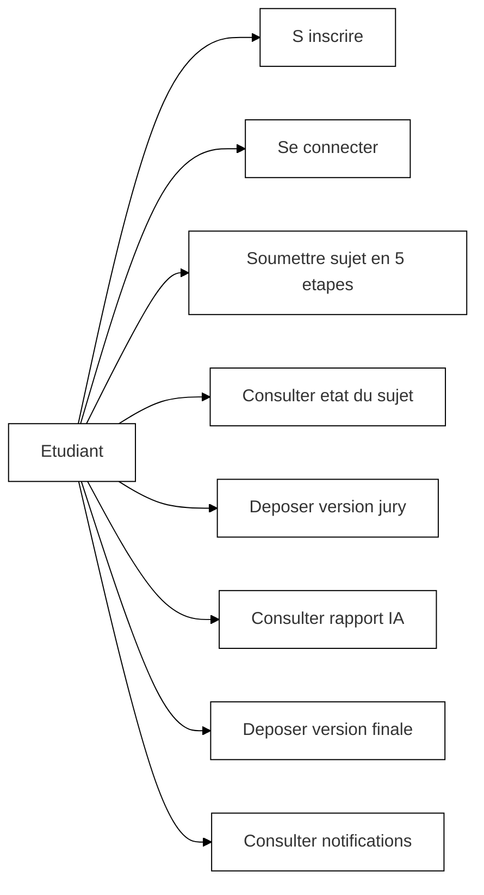

### 2.3 Diagramme de cas d'utilisation - Chef de Departement

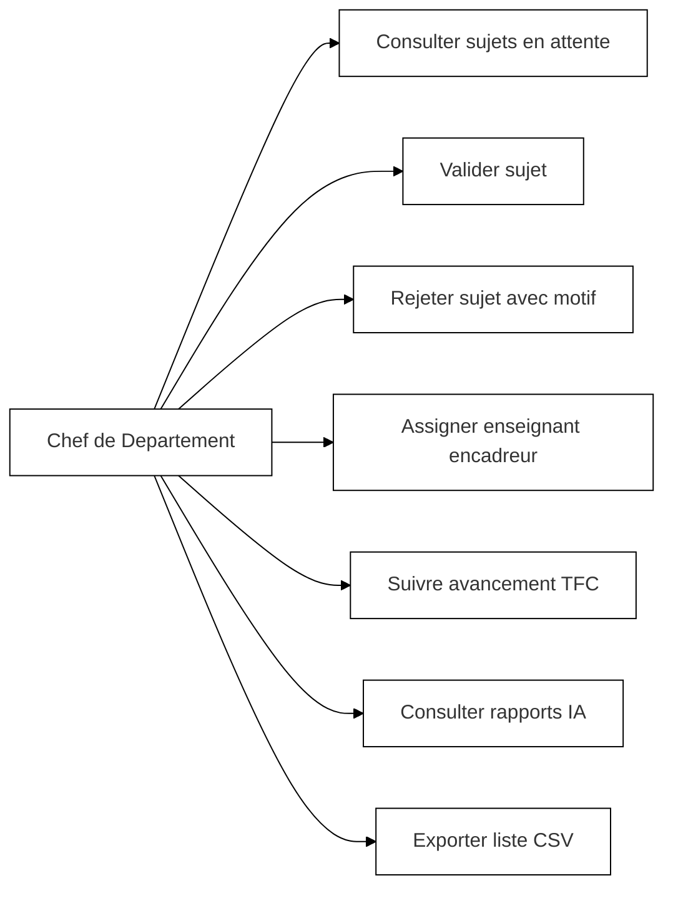

### 2.4 Diagramme de cas d'utilisation - Enseignant

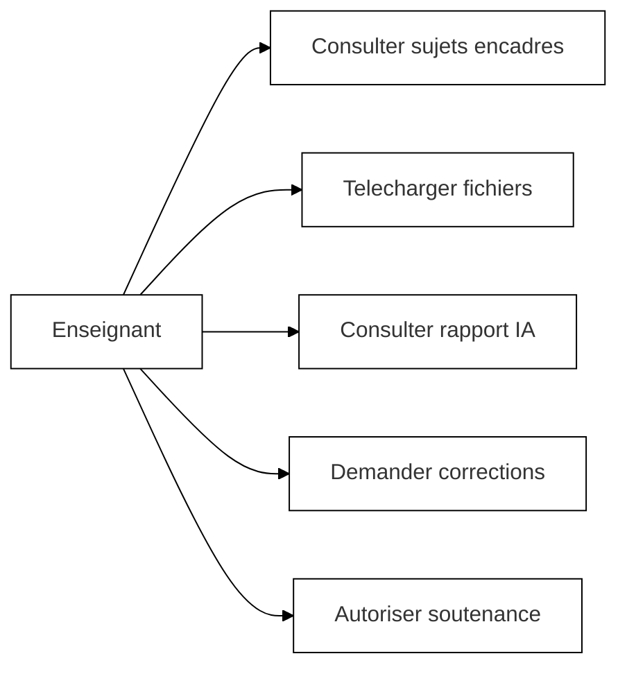

### 2.5 Diagramme de cas d'utilisation - Administrateur

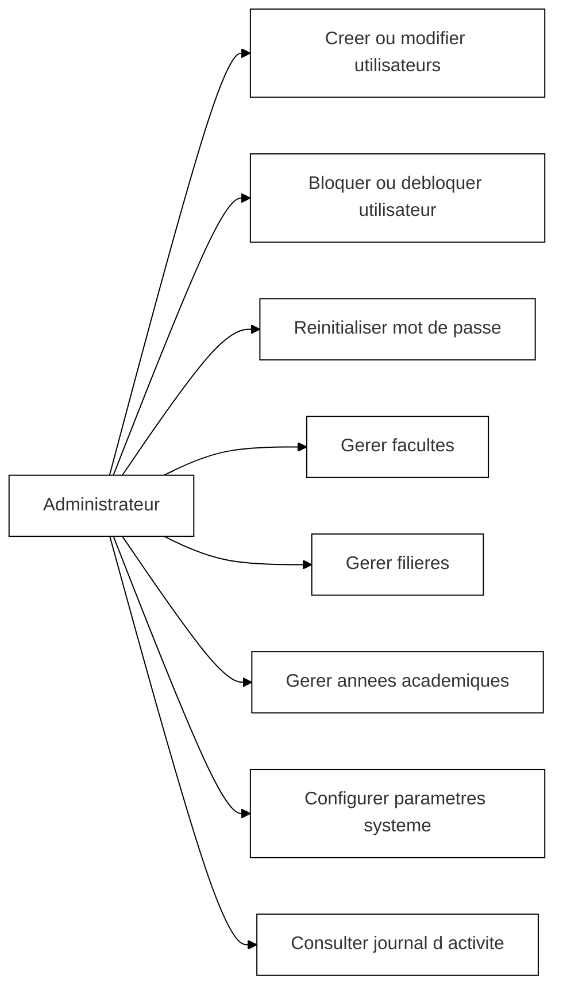

## Chapitre II - Section 3 : Diagrammes de sequence

### 3.1 Sequence - Soumission de sujet

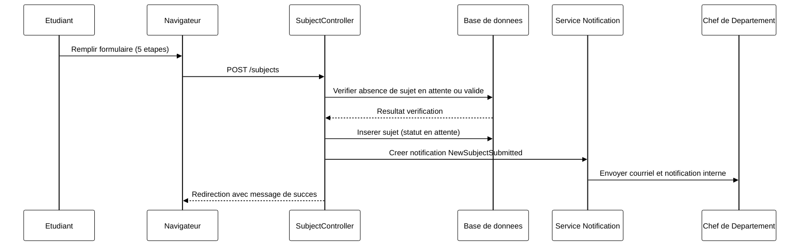

### 3.2 Sequence - Validation ou rejet de sujet

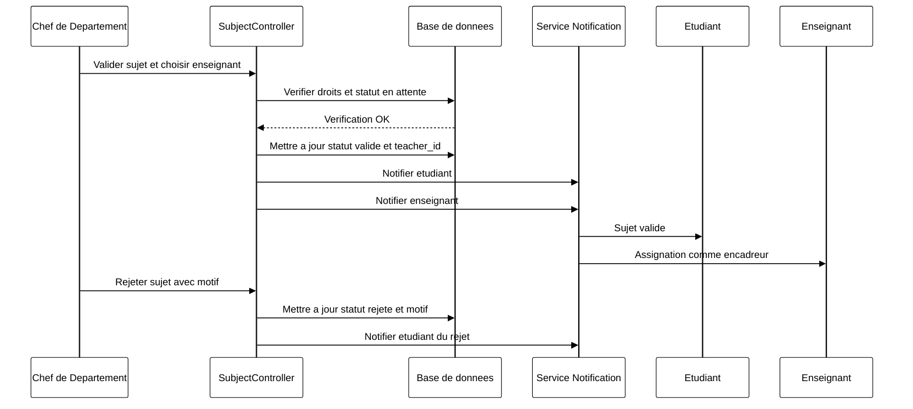

### 3.3 Sequence - Depot de fichier TFC avec analyse IA

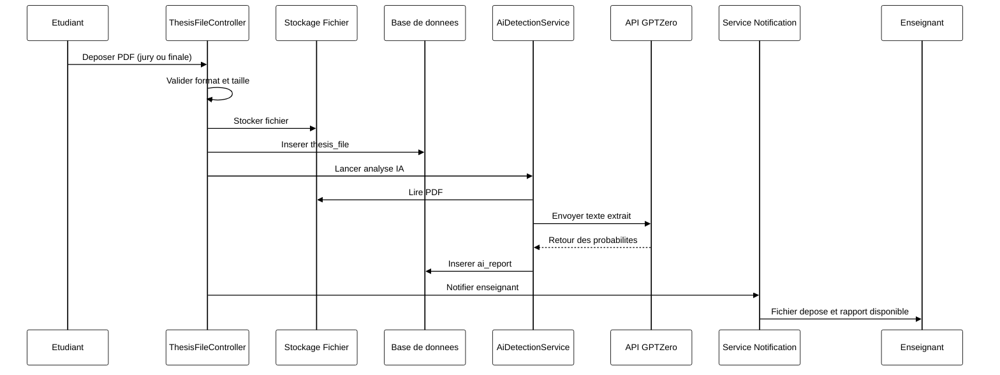

### 3.4 Sequence - Autorisation de soutenance

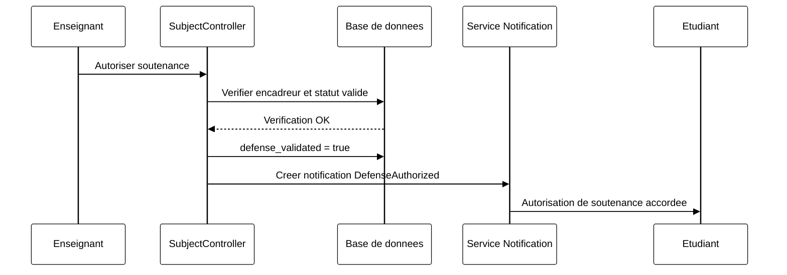

## Chapitre II - Section 4 : Diagramme de classes

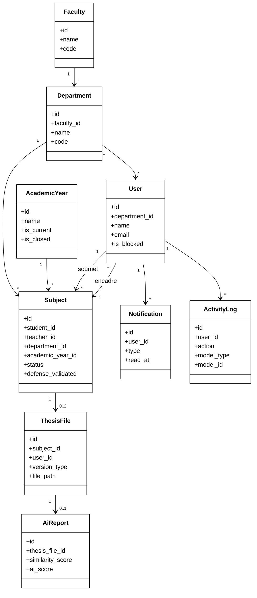

## Chapitre II - Section 5 : Modele relationnel de la base de donnees

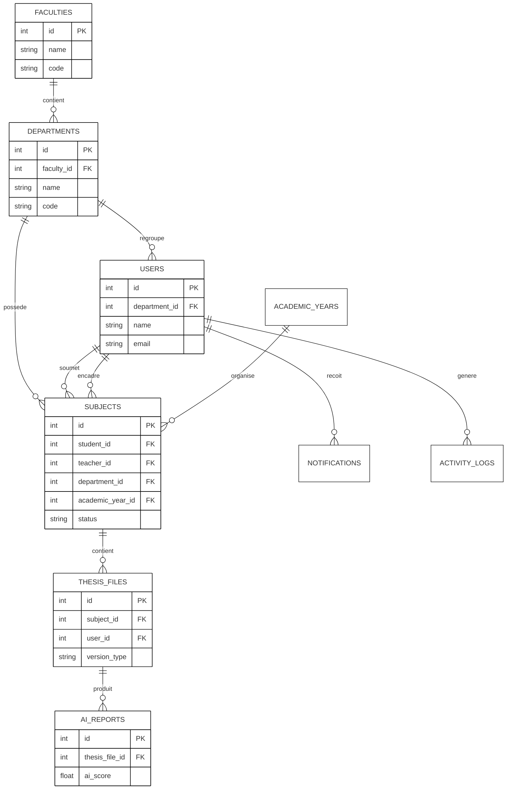

## Chapitre II - Section 6 : Diagramme d'activites (processus complet)

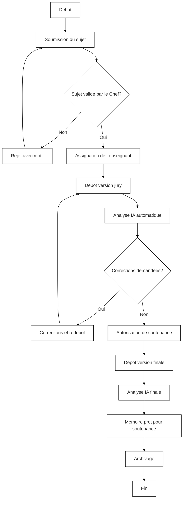

## Chapitre III - Section 2 : Architecture MVC de Laravel

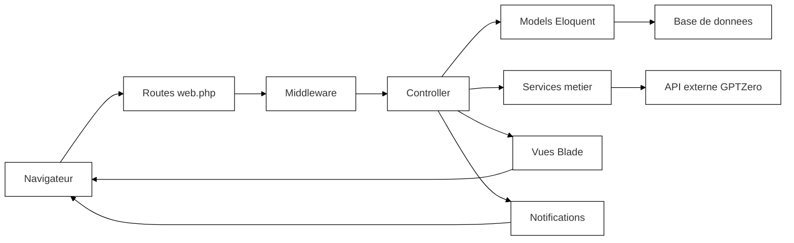

---

## Notes d'impression

- Theme monochrome applique a chaque diagramme.
- Impression recommandee en niveaux de gris.
- Compatible avec export PDF depuis VS Code ou GitHub.
