# Diagrammes en Noir et Blanc - Version par Figure

Ce document presente les diagrammes figure par figure, dans l'ordre de la liste des figures.
Tous les diagrammes sont en noir et blanc.

## Figure 2 - Diagramme de cas d'utilisation global

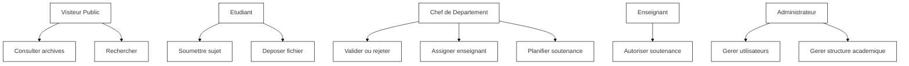

## Figure 3 - Cas d'utilisation Etudiant

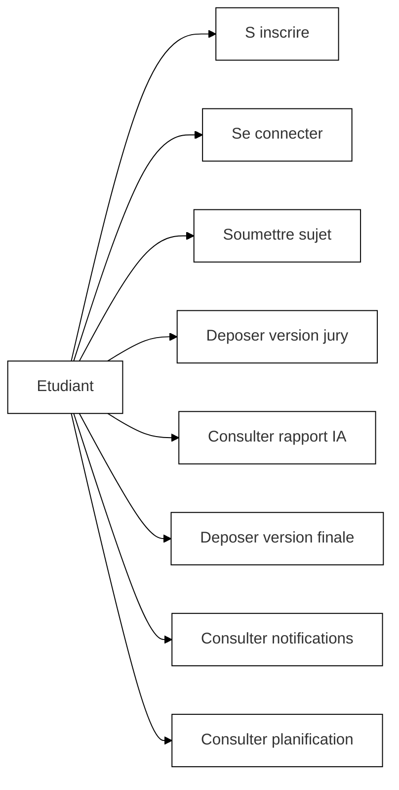

## Figure 4 - Cas d'utilisation Chef de Departement

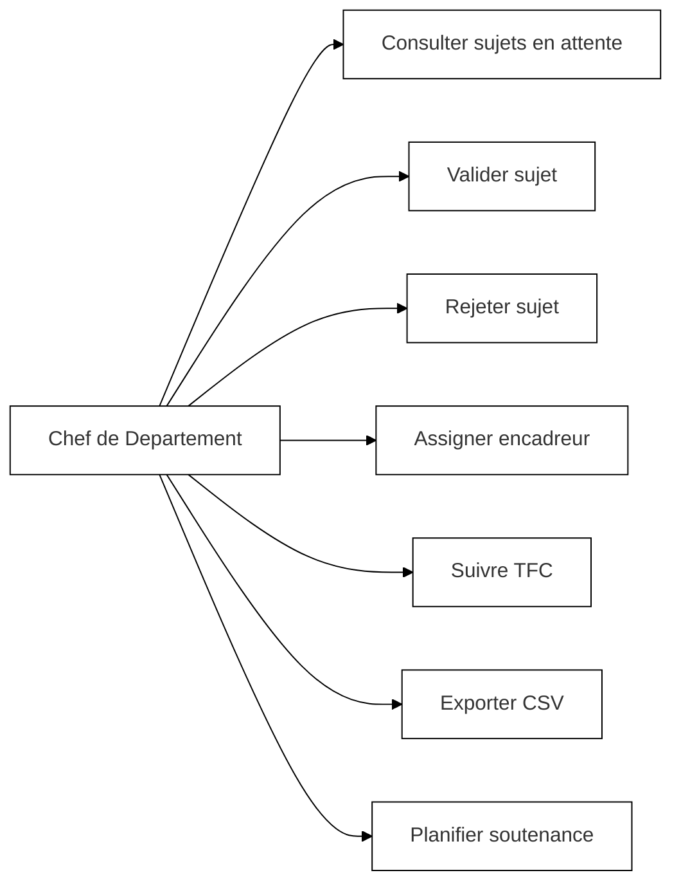

## Figure 5 - Cas d'utilisation Enseignant

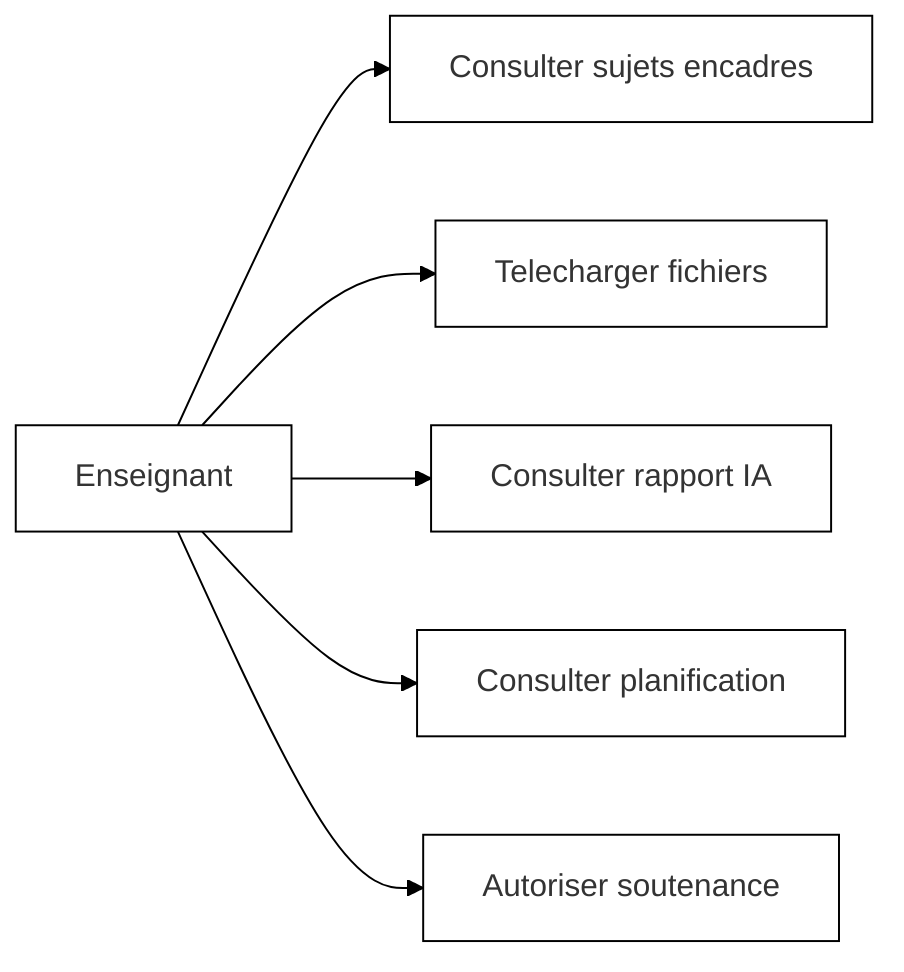

## Figure 6 - Cas d'utilisation Administrateur

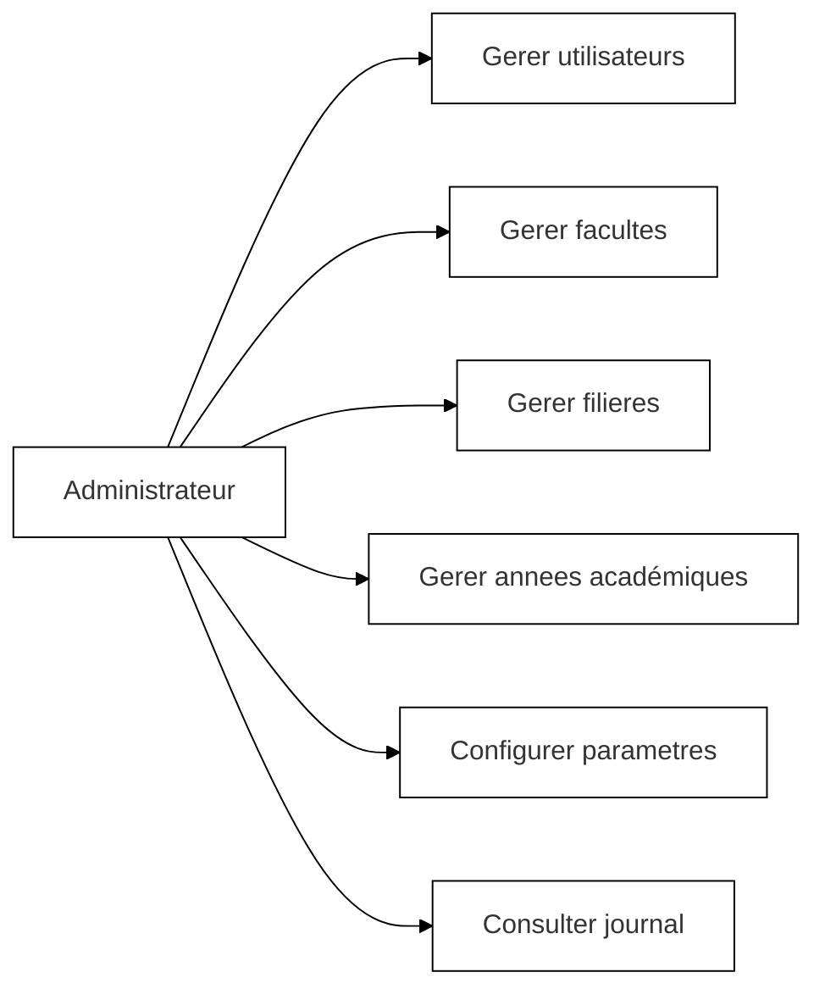

## Figure 7 - Sequence Soumission de sujet

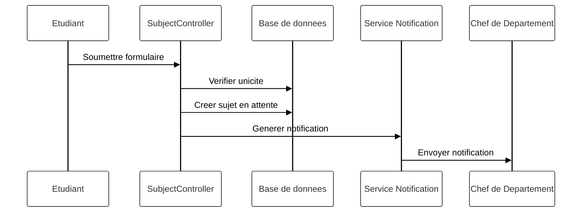

## Figure 8 - Sequence Validation ou rejet

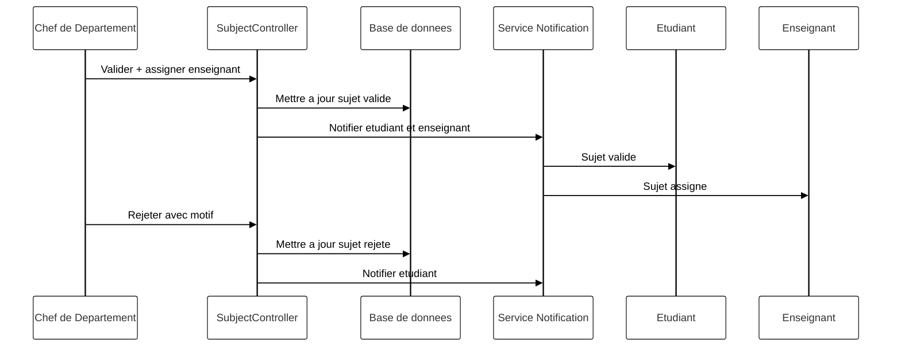

## Figure 9 - Sequence Depot de fichier avec analyse IA

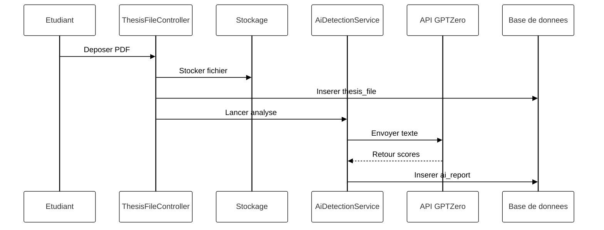

## Figure 10 - Sequence Autorisation de soutenance

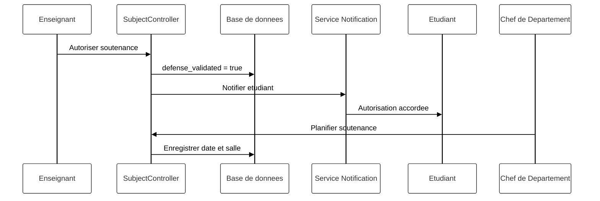

## Figure 11 - Diagramme de classes

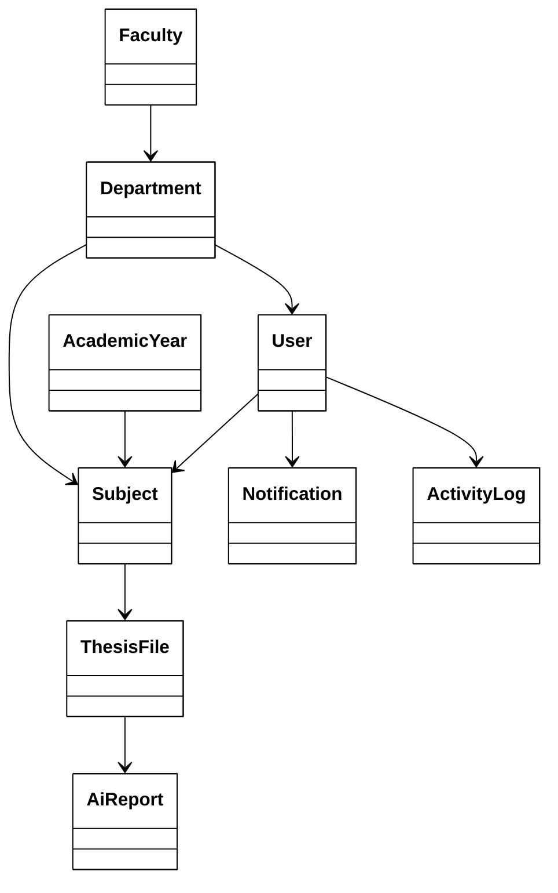

## Figure 12 - Modele relationnel de la base de donnees

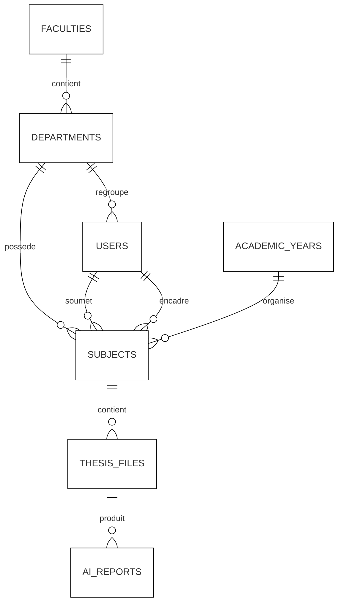

## Figure 13 - Diagramme d'activites du processus complet

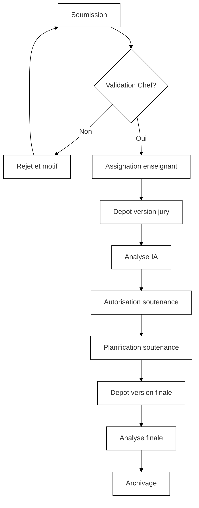

## Figure 14 - Architecture MVC de Laravel

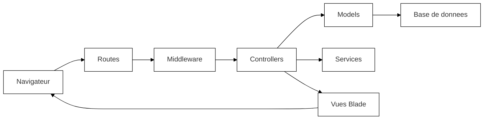

---

## Note technique — Serveur utilisé

- En développement : `php artisan serve` (serveur PHP intégré de Laravel).
- En production : Apache ou Nginx avec PHP-FPM (préconisé pour les performances et la sécurité).
- Front-end (développement) : `npm run dev` (Vite) pour le rechargement et la compilation des assets.

## Recommendation d'usage

- Utiliser `DIAGRAMMES-PAR-CHAPITRE-NB.md` pour la redaction du memoire.
- Utiliser `DIAGRAMMES-PAR-FIGURE-NB.md` pour la liste des figures et annexes.
